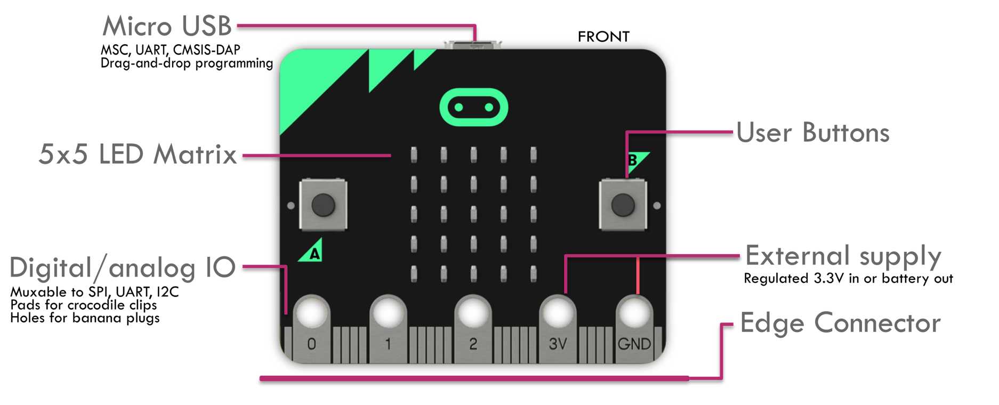
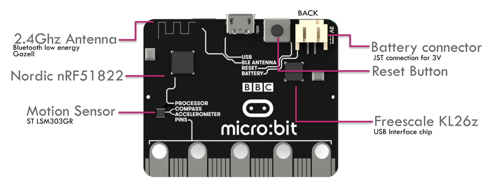

# Micro:Bit

Der BBC micro:bit ist ein Einplatinencomputer auf der Basis eines ARM-Mikrocontrollers und kann mittels verschiedener webbasierter Entwicklungsumgebungen programmiert werden.

Mehr Informationen findest Du auf 
[Wikipedia](https://de.wikipedia.org/wiki/BBC_micro:bit)
oder der [Microbit Website](https://microbit.org).

Der Einplatinencomputer beinhaltet bereits einige Anschlüsse und Sensoren, um direkt und ohne weiteres Zubehör mit der Entwicklung und dem Experimentieren zu beginnen.

## Hardwareüberblick

Über folgende integrierte Hardware und Sensoren verfügt der Mico:Bit.

### Prozessormodul nRF51

Der Micro:Bit basiert auf dem nRF51 System on Chip (SoC) von Nordic Semiconductor. Der Chip beinhaltet einen ARM Cortex M0 Prozessor, General Input / Output sowie verschiedene energiesparende Funkübertragungstechnologien.

### Bluetoothmodul

Bluetooth Low Energy ist bereits in den nRF51-SoC integriert.

### Funkmodul (2,4 GHz)

Eine propritäre Funktechnologe auf Basis des 2,4 GHz Bandes ist bereits in den nRF51-SoC integriert.

### 2 Buttons (Knöpfe)

Auf dem Micro:Bit sind insgesamt drei Knöpfe angebracht. Der auf der Rückseite dient ausschließlich dem Zurücksetzen des Gerätes. Die beiden Knöfe auf der Vorderseite können in Programmen frei programmiert werden.

### LED-Matirx-Display (5x5 Pixel)

Auf der Vorderseite ist ein 5x5 Punkt Matix-Display angebracht. Das Display kann z.B. zur Anzeige von Schrift und Zahlen verwendet werden.

### Bewegungssensor / Kompass

Auf der Rückseite des Micro:Bit ist ein kombinierter 3-Achsen-Bewegungssensor und Kompass angebracht, der es in Programmen ermöglicht z.B. Bewegungen und Erschütterungen zu erkennen.

### CPU-Temperatursensor (integriert in nRF51)

In dem SoC ist ein Sensor integriert, der die Temperatur der CPU misst. Aus der CPU-Temperatur lässt sich mit einer gewisse Ungenauigkeit die Umgebungstemperatur ableiten. Die Software geht dabei davon aus, dass der Prozessor i.d.R. nicht sonderlich stark ausgelastet ist.

### Ein- und Ausgabekontakte (GPIO)

Am unteren Ende des Micro:Bit ist eine Kontaktleiste angebracht, über die weitere Sensoren und Geräte angeschlossen werden können. Einige der Kontakte sind auch für Bananenstecker oder Krokodilklemmen geeignet und ermöglichen damit z.B. sehr leicht den Anschluss von einfachen Sensoren.

