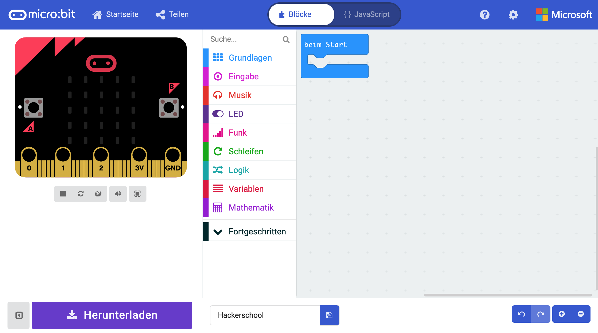

# MakeCode

Bein MakeCode handelt es sich um einen Browser-basierter online Code-Editor von Microsoft, mit dem für unterschiedliche Plattformen entwickelt werden kann. MakeCode unterstützt gleichermaßen die Entwicklung mit visuellen Elementen, sogenannten Blocks, als auch die Entwicklung mit JavaScript.

Für unterstützte Plattformen, zu denen auch _Micro:Bit_ gehört, ist keine Installation von zusätzlicher Software notwendig. Des weiteren wird Code direkt in einem Simulator im Browser ausgeführt.

Weiterführende Informationen gibt es auf der Projektseite von [Microsoft MakeCode](https://www.microsoft.com/en-us/makecode "Microsoft MakeCode") oder bei [Micro:Bit](https://makecode.microbit.org "Micro:Bit").

## MakeCode Beispiele

Die MakeCode Beispiele bringen Dir Schritt für Schritt den MakeCode-Editor und die einzelnen Block-Elemente näher. Lerne mit jeder Lektion etwas neue Funktionen des __Micro:Bit__ kennen und entwickle zunehmend komplexere Programme. 

### Einführung

Die [Einführung](makecode/lesson00_introduction/README.md) macht Dich zunächst mit dem MakeCode-Editor vertraut. 

### Lektion 1 - Blinkendes Icon

In [Lektion 1](makecode/lesson01_blink_icon/README.md) bringst Du ein Icon auf dem 5x5 Pixel LED-Feld des Micro:Bit zum blinken. Du lernst dabei die Grundfunktionen kennen.

### Lektion 2 - Button

In [Lektion 2](makecode/lesson02_button/README.md) beschäftigst Du Dich mit den beiden Knöpfen des Micro:Bit und lernst dabei auf Ereignisse (Events) zu reagieren.

### Lektion 3 - Schleifen (Loops)

In [Lektion 3](makecode/lesson03_loop/README.md) verschaffst Du Dir einen ersten Überblick über die wichtigste Kontrollelemente, konkret am Beispiel einer Schleife und einer Wenn-Dann-Verzweigung.

### Lektion 4 - Variablen
[Lektion 4](makecode/lesson04_variable/README.md)

### Lektion 5 - Funktionen

[Lektion 5](makecode/lesson05_first_function/README.md)

### Lektion 10 - Lautsprecher anschließen

[Lektion 10](makecode/lesson10_adding_speaker/README.md)

### Lektion 11 - Verkehrsampel

[Lektion 11](makecode/lesson11_traffic_light/README.md)

### Lektion 12 - Entfernung mit Sonar

[Lektion 12](makecode/lesson12_sonar_sensor/README.md)

### Lektion 13 - Neopixel

[Lektion 13](makecode/lesson13_neopixel/README.md)

### Lektion 14 - Temperatursensor DHT11 oder DHT22

[Lektion 14](makecode/lesson14_temperature_Sensor/README.md)

### Lektion 15 - Spiel _Catch the Egg_

[Lektion 15](makecode/lesson15_game_catch_the_egg/README.md)

## Micropython Beispiele

### Lektion 1 - Hallo

### Lektion 11 - Temperatursensor
