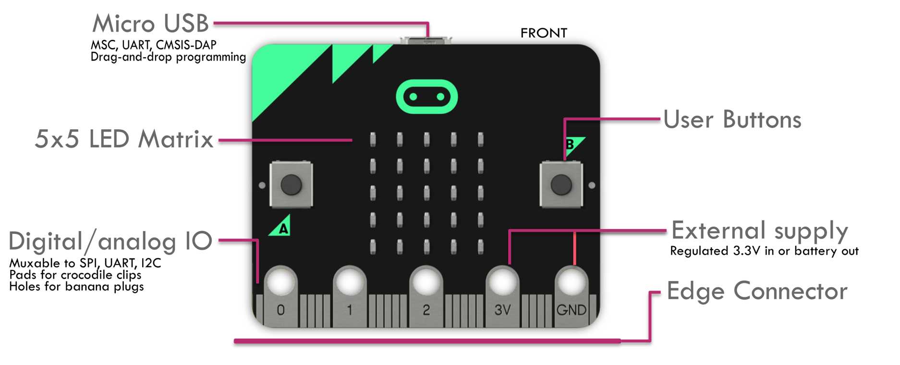
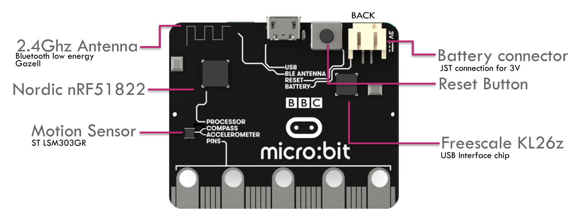

# Einleitung

## Einführung in Micro:Bit und den MakeCode Editor

### Micro:Bit

Der BBC micro:bit ist ein Einplatinencomputer auf der Basis eines ARM-Mikrocontrollers und kann mittels verschiedener webbasierter Entwicklungsumgebungen programmiert werden.

Mehr Informationen findest Du auf 
[Wikipedia](https://de.wikipedia.org/wiki/BBC_micro:bit)
oder der [Microbit Website](https://microbit.org).

Der Einplatinencomputer beinhaltet bereits einige Anschlüsse und Sensoren, um direkt und ohne weiteres Zubehör mit der Entwicklung und dem Experimentieren zu beginnen.

#### Hardwareüberblick

Über folgende integrierte Hardware und Sensoren verfügt der Mico:Bit.

##### Prozessormodul nRF51

Der Micro:Bit basiert auf dem nRF51 System on Chip (SoC) von Nordic Semiconductor. Der Chip beinhaltet einen ARM Cortex M0 Prozessor, General Input / Output sowie verschiedene energiesparende Funkübertragungstechnologien.

##### Bluetoothmodul

Bluetooth Low Energy ist bereits in den nRF51-SoC integriert.

##### Funkmodul (2,4 GHz)

Eine propritäre Funktechnologe auf Basis des 2,4 GHz Bandes ist bereits in den nRF51-SoC integriert.

##### 2 Buttons (Knöpfe)

Auf dem Micro:Bit sind insgesamt drei Knöpfe angebracht. Der auf der Rückseite dient ausschließlich dem Zurücksetzen des Gerätes. Die beiden Knöfe auf der Vorderseite können in Programmen frei programmiert werden.

##### LED-Matirx-Display (5x5 Pixel)

Auf der Vorderseite ist ein 5x5 Punkt Matix-Display angebracht. Das Display kann z.B. zur Anzeige von Schrift und Zahlen verwendet werden.

##### Bewegungssensor / Kompass

Auf der Rückseite des Micro:Bit ist ein kombinierter 3-Achsen-Bewegungssensor und Kompass angebracht, der es in Programmen ermöglicht z.B. Bewegungen und Erschütterungen zu erkennen.

##### CPU-Temperatursensor (integriert in nRF51)

In dem SoC ist ein Sensor integriert, der die Temperatur der CPU misst. Aus der CPU-Temperatur lässt sich mit einer gewisse Ungenauigkeit die Umgebungstemperatur ableiten. Die Software geht dabei davon aus, dass der Prozessor i.d.R. nicht sonderlich stark ausgelastet ist.

##### Ein- und Ausgabekontakte (GPIO)

Am unteren Ende des Micro:Bit ist eine Kontaktleiste agebracht, über die weitere Sensoren und Geräte angeschlossen werden können. Einige der Kontakte sind auch für Bananenstecker oder Krokodilklemmen geeignet und ermöglichen damit z.B. sehr leicht den Anschluss von einfachen Sensoren.

### MakeCode Editor

Der MakeCode Editor ermöglicht die visuelle Programmierung des Micro:Bit über grafische Blöcke. Die einzelnen Blöcke können kontextabhängig inneinander verschachtelt werden um einen Programmablaufplan zu erstellen. 

Der MakeCode Editor enthält eine Vorschau die es ermöglicht die meisten Änderungen direkt in einem virtuellen Micro:Bit nachverfolgen zu können. 

Im Hintergrund erstellt der MakeCode Editor JavaScript-Code, der durch Umschalten des Modus direkt im MakeCode Editor eingesehen werden kann. Darüber hinaus ist es auch möglich, direkt Javascript Code zu schreiben und sich diesen in der visuellen Blockdarstelung anzeigen zu lassen.

#### Blöcke (Blocks)

Im MakeCode Editor gibt es verschiedene Blöcke.

##### Grundlagen (hell blau)

Unter diesem Punkt finden sich einige grundlegende Blöcke, z.B. die Hauptschleife oder der Zugriff auf das LED-Display.

Zwei besonder Blöcke sind die Blöcke __beim Start__  und __dauerhaft__. Beim Micro:Bit wird der Block __beim Start__ automatisch einmalig beim Starten oder Zurücksetzen ausgeführt. Daher eignet sich dieser Block um Aufgaben zu erledigen, die exakt einmal beim Programmstart ausgeführt werden sollen.
Alles Blöcke im Block __dauerhaft__ werden ständig und nacheinande wiederholt, er stellt also einen endlose Widerholung (siehe Schleifen) dar. Der Block eignet sich daher um Programmteile darin zu platzieren, die regelmäßig immer wieder ausgeführt werden müssen, z.B. das regelmäßige Abfragen eines Sensors.

##### Eingabe (pink)

In diesem Abschnitt finden sich Blöcke um auf Bewegungen oder Knopfdrücke zu reagieren.

##### Musik (hell rot)

Mit den Blöcken aus dem Bereich Musik können Töne und Melodien auf einen separat anschließbaren Lautsprecher ausgegeben werden.

##### LED (dunkel blau)

##### Funk (magenta)

Hinter dem Punkt verbergen sich Blöcke um mit dem Funkmodulen des nRF51 Daten senden und empfangen zu können.

##### Schleifen (grün)

Programme beinhalten oft wiederkehrende Aufgaben. Um solche programmieren zu können, beinhaltet dieses Menü Blöcke um unterschiedliche Schleifen zu entwickeln. 

##### Logik (türkis)

##### Variablen (dunkel rot)

##### Mathematik (lila)

##### Fortgeschritten (schwarz)

