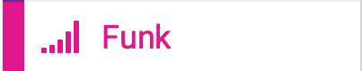

# Lektion 0
## Einführung in Micro:Bit den MakeCode Editor

### Micro:Bit

Der BBC micro:bit ist ein Einplatinencomputer auf der Basis eines ARM-Mikrocontrollers und kann mittels verschiedener webbasierter Entwicklungsumgebungen programmiert werden.

Mehr Informationen findest Du auf 
[Wikipedia](https://de.wikipedia.org/wiki/BBC_micro:bit)
oder der [Microbit Website](https://microbit.org)

Der Einplatinencomputer beinhaltet bereits einige Anschlüsse und Sensoren, um direkt und ohne weiteres Zubehör mit der Entwicklung und dem Experimentieren zu beginnen.

#### Hardwareüberblick

### MakeCode Editor

Der MakeCode Editor ermöglicht die visuelle Programmierung des Micro:Bit über grafische Blöcke. Die einzelnen Blöcke können kontextabhängig inneineander Verschachtelt werden um einen Programmablaufplan zu erstellen. 

Der MakeCode Editor enthält eine Vorschau die es ermöglicht die meisten Änderungen direkt in einem virtuellen Micro:Bit nachverfolgen zu können. 

Im Hintergrund erstellt der MakeCode Editor JavaScript-Code, der durch Umschalten des Modus direkt im MakeCode Editor eingesehen werden kann. Darüber hinaus ist es auch möglich, direkt Javascript Code zu schreiben und sich diesen in der visuellen Blockdarstelung anzeigen zu lassen.

#### Blöcke (Blocks)

Im MakeCode Editor gibt es verschiedene Blöcke.

##### Grundlagen (hell blau)

##### Eingabe (pink)

##### Musik (hell rot)

##### LED (dunkel blau)

##### Funk (magenta)

##### Schleifen (grün)

##### Logik (türkis)

##### Variablen (dunkel rot)

##### Mathematik (lila)

##### Fortgeschritten (schwarz)

