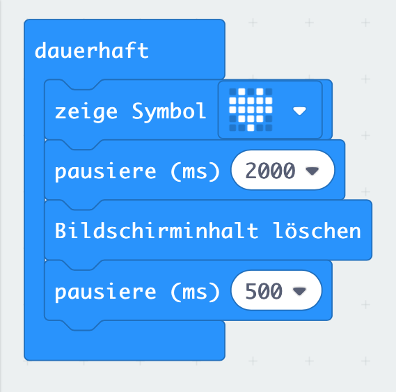

# Lektion 1
## Blinkendes Icon

Nutze eine Endlosschleife um abwechselnd ein Icon anzuzeigen und den LED-Bildschirm zu löschen. 
Zwischen dem Anzeigen und Löschen soll jeweils eine Sekunde Pause eingehalten werden.

##### Blocks

