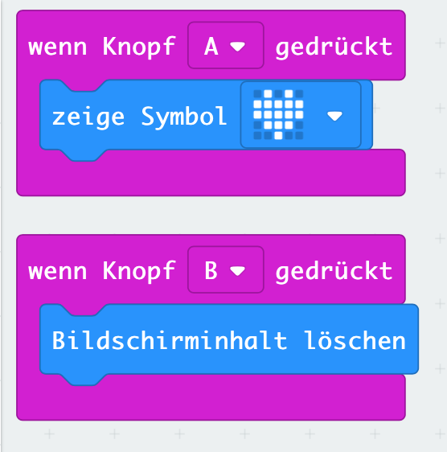

# Lektion 2 - Buttons (Knöpfe)

Verwende die beiden Button (Knöpfe) Deines __Micro:Bit__ um über den Knopfdruck ein Ereignis auszulösen. 

## Anleitung

Nutze die beiden Button Deines Micro:bit um abwechselnd ein Icon anzuzeigen und zu löschen.
Du benötigst dazu Blöcke aus dem `Eingabe`-Block.

Bei Druck auf den Button `A` wird ein Herz angezeigt.

Bei Druck auf den Button `B` der Bildschirm wieder gelöscht

## Blocks

So könnte Dein Programm aussehen.

## Javascript-Code


    

