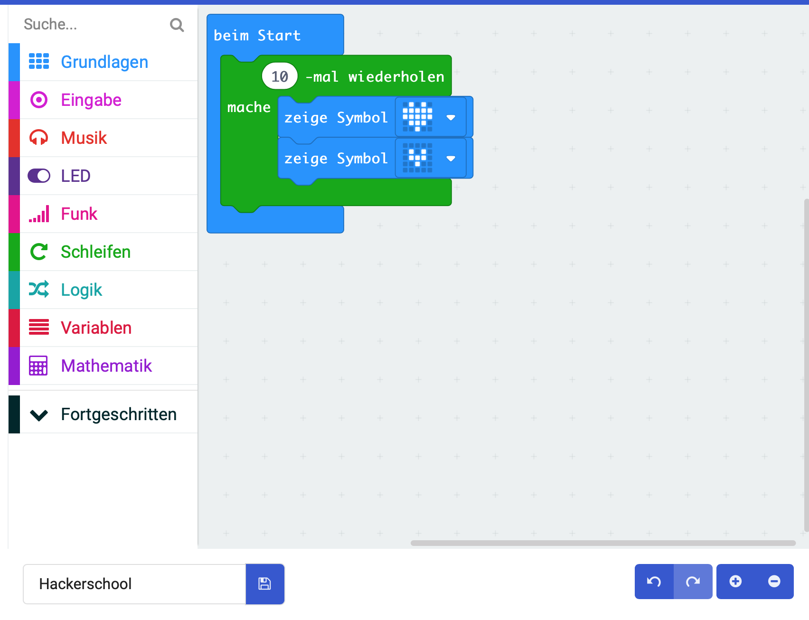

# Lektion 3 - Schleifen (loops)

## Anleitung

Erstelle eine Schleife mit 10 Durchläufen. In jedem Durchlauf soll erst das Icon `großes Herz` und dann das Icon `kleines Herz` angezeigt werden.

## Blocks

So könnte Dein Programm aussehen.

## Javascript-Code


    

