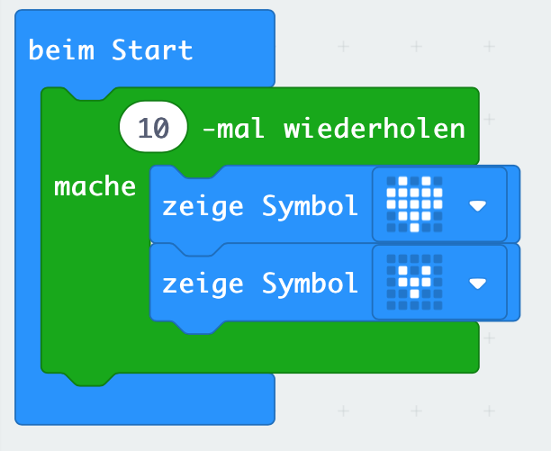

# Lektion 3 - Schleifen (loops)

## Anleitung

Erstelle eine Schleife mit 10 Durchläufen. In jedem Durchlauf soll erst das Icon `großes Herz` und dann das Icon `kleines Herz` angezeigt werden.

## Blocks

So könnte Dein Programm aussehen.

## Ergebnis (Simulation)

<iframe style="position:absolute;top:0;left:0;width:100%;height:100%;" src="https://makecode.microbit.org/---run?id=_KYzP1bfFm9yp" allowfullscreen="allowfullscreen" sandbox="allow-popups allow-forms allow-scripts allow-same-origin" frameborder="0"></iframe>

## Javascript-Code


    


## Makecode Projekt

[Lektion 3 (Schleifen) als Makecode-Projekt](https://makecode.microbit.org/#pub:_KYzP1bfFm9yp)