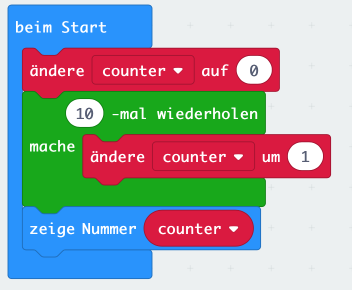

# Lektion 4 - Variablen (variables)

In dieser Lektion beschäftigen wir uns damit, wie wir uns im Programm Werte temporär merken können. Wollen wir z.B. in einer Schleife wissen im wie vieltem Schleifendurchgang (welche Iteration) wir uns befinden, so müssen wir uns diesen Wert merken. 

## Anleitung 

Definiere eine Variable mit dem Namen _counter_. Setze den Anfangswert der Variablen _counter_ auf 0.

Erstelle eine Schleife mit 10 Durchgängen und erhöhe die Variable _counter_ in jedem Durchgang um den Wert 1.

Stelle nach Beendigung der 10 Schleifendurchgänge den Wert der Variablen _counter_ auf dem LED-Bildschirm dar.

## Blocks

So könnte Dein Programm aussehen.

## Javascript-Code


    

