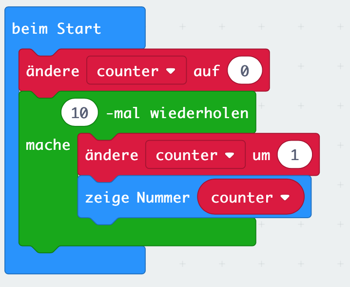

# Lektion 4

## Variablen (variables)

Definiere eine Variable mit dem Namen _counter_. Setze den Anfangswert der Variablen _counter_ auf 0.

Erstelle eine Schleife mit 10 Durchgängen und erhöhe die Variable _counter_ in jedem Durchgang um den Wert 1.

Stelle nach Beendigung der 10 Schleifendurchgänge den Wert der Variablen _counter_ auf dem LED-Bildschirm dar.

##### Blocks

