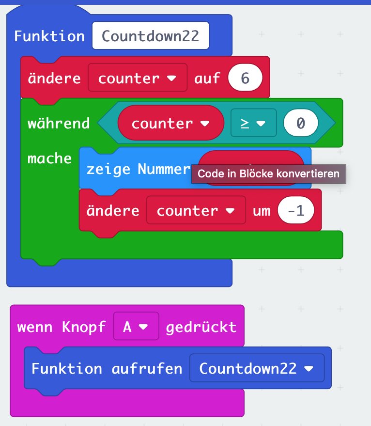

# Lektion 5 - Funktionen (functions)

Oft möchte man in einem Programm an verschiedenen Stellen dieselben Blöcke ausführen. Damit man diese nicht mehrfach hinzufügen muss, können diese Schritte in eine Funktion ausgelagert  und von verschiedenen Stellen aus aufgerufen werden.

In dieser Lektion wollen wir einen Countdown in einer Funktion implementieren, die wir dann beim Druck auf einen Knopf aufrufen.

## Anleitung

Erstelle eine Funktion und rufe diese beim Druck auf Button `A` auf.

Die Funktion soll eine Variable `counter` definiern und mit dem initialen Wert __6__ belegen.

Innerhalb einer Schleife wird die Variable `counter` pro Schleifendurchlauf um die Zahl __1__ verringert.

In jedem Schleifendurchlauf wird der aktuelle Wert der Variablen `counter` auf dem Bildschirm dargestellt.

## Blocks

So könnte Dein Programm aussehen.

## Javascript-Code


    

