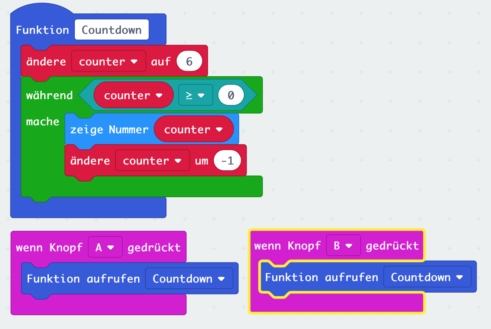

# Lektion 5

## Funktionen (Functions)

Erstelle eine Funktion und rufe diese beim Druck auf Button __A__ auf.

Die Funktion soll eine Variable _counter_ definiern und mit dem initialen Wert 6 belegen.

Innerhalb einer Schleife wird die Variable _counter_ pro Schleifendurchlauf um die Zahl 1 verringert.

In jedem Schleifendurchlauf wird der aktuelle Wert der Variablen _counter_ auf dem Bildschirm dargestellt.

##### Blocks

