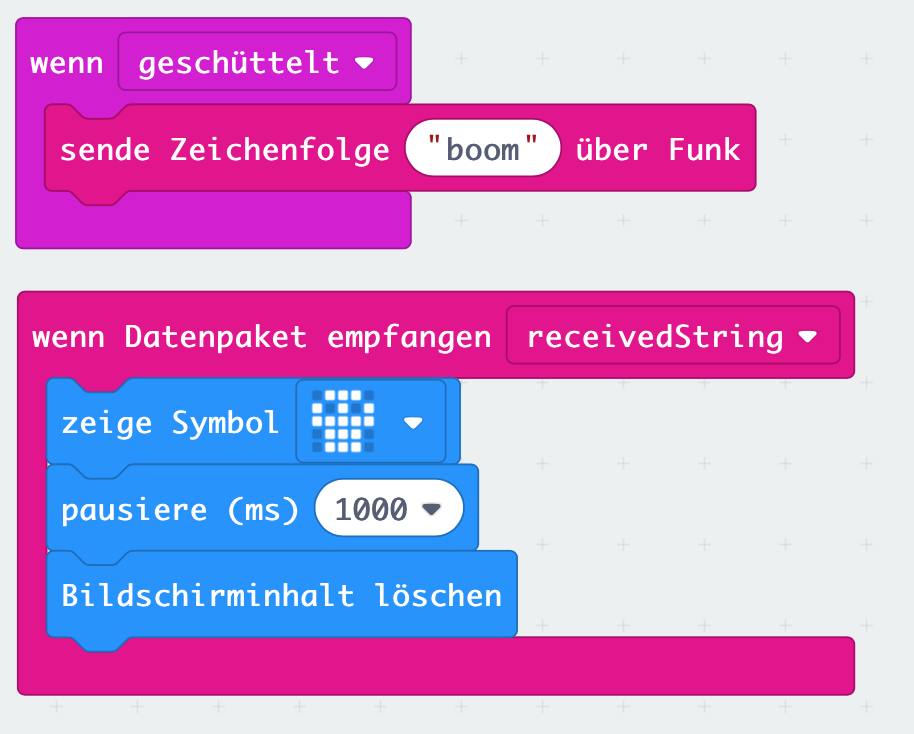

# Lektion 6 - Daten per Funk übertragen

Dein Micro:Bit verfügt über ein eingebautes Funkmodul, mit dem Daten zwischen zwei oder mehreren __Micro:Bit__ übertragen werden können.

Nutze das Funkmodul um den Text _"boom"_ von einem __Micro:Bit__ an einen anderen zu übertragen sobald Deinen __Micro:Bit__ schüttelst. Auf dem anderen __Micro:Bit__ soll daraufhin für etwa eine Sekunde das `Totenkopf`-Symbol angezeigt werden.

## Anleitung

Nutze aus dem Block `Eingabe` das Ereignis `wenn geschüttelt` und aus dem Block `Funk` den Block `sende Zeichenfolge` um den Code für den sendenden __Micro:Bit__ zu erstellen.

Verwende zusätzlich aus dem Block `Funk` den Block `wenn Datenpaket Empfangen` um auf dem empfangenden __Micro:Bit__ auf ein Datenpaket zu reagieren.

__ACHTUNG:__ In dieser Lektion werden zwei __Micro:Bits__ mit demselben Code programmiert. D.h. beide können Datenpakete senden und empfangen.

## Blocks

So könnte Dein Programm aussehen.

## Ergebnis (Simulation)

<iframe style="position:absolute;top:0;left:0;width:100%;height:100%;" src="https://makecode.microbit.org/---run?id=_Te8bCcdfpAWc" allowfullscreen="allowfullscreen" sandbox="allow-popups allow-forms allow-scripts allow-same-origin" frameborder="0"></iframe>

## Javascript-Code


    


## Makecode Projekt

[Lektion 6 (Funkmodul) als Makecode-Projekt](https://makecode.microbit.org/#pub:_Te8bCcdfpAWc