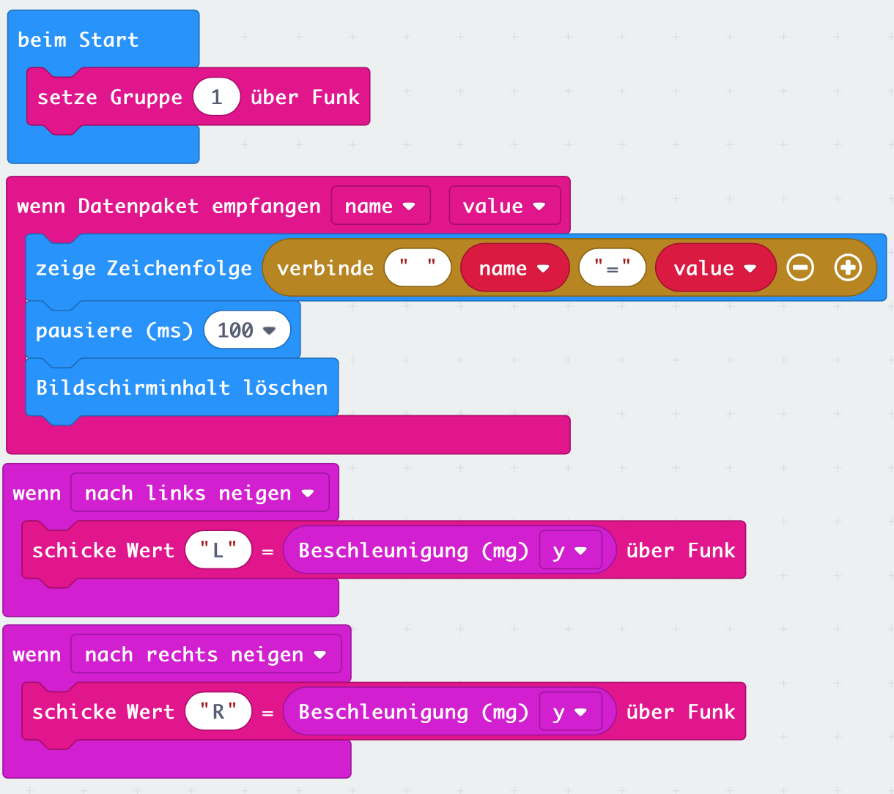

# Lektion 7 - Bewegungen per Funk übertragen

In der vorherigen Lektion hast Du bereits gelernt, dass Dein __Micro:Bit__ über ein eingebautes Funkmodul verfügt, mit dem Daten zwischen zwei oder mehreren __Micro:Bit__ übertragen werden können.

In dieser Lektion wollen wir zusätzlich 

## Anschlüsse

___ToDo___

## Anleitung

___ToDo___

## Blocks

So könnte Dein Programm aussehen.

## Javascript-Code


    

