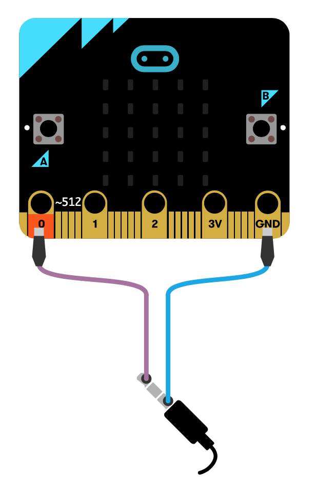
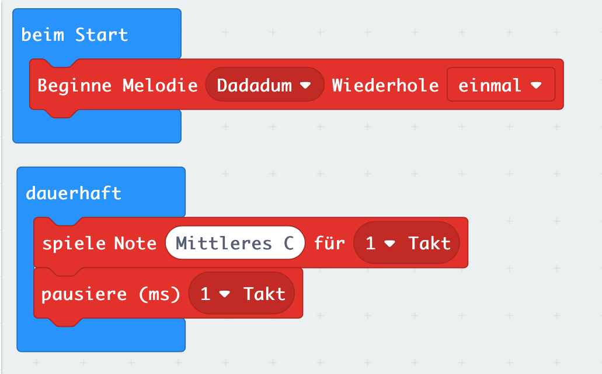

# Lektion 9 - Lautsprecher anschließen 

Dein Micro:Bit verfügt über die Möglichkeit Töne und Melodien abzuspielen. Die entsprechenden Blöcke findest Du unter dem Punkt __Musik__. Leider besitz der Micro:Bit selbst aber keinen Lautsprecher, über den die Töne ausgegeben werden können.

In dieser Lektion wollen wir deshalb einen zusätzlichen Lautsprecher an der Kontaktleiste des Micro:Bit anschließen und über diesen Töne und Melodien ausgeben.

## Anschlüsse

Schließe einen Lautsprecher an Deinen Micro:Bit an. Verbinde dazu, wie in dem Bild dargestellt, den Anschluß __0__ und __GND__ jeweils mit einer Krokodilklemme mit dem ersten und dem letzten Kontakt des Klinkensteckers Deines Lautsprechers.

## Anleitung

Verwende den __beim Start__ Block um beim Einschalten oder Zurücksetzen des Micro:Bit die Melodie __Dadadum__ abzuspielen.

Erstelle zusätzlich eine Endlosschleife (Block __dauerhaft__) in der Du abwechselnd für __einen Takt__ die Note  __Mittleres C__ abspielst und __einen Takt__ lang eine __Pause__ einlegst.

## Blocks

So könnte Dein Programm aussehen.

