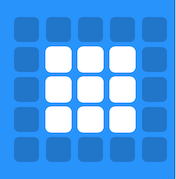
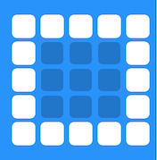
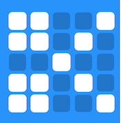
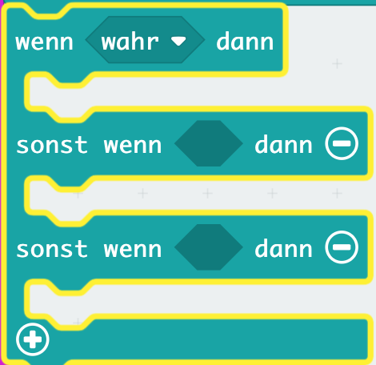
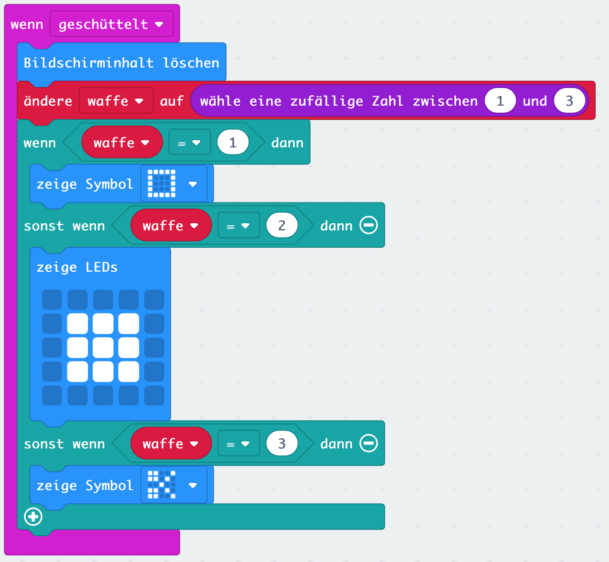
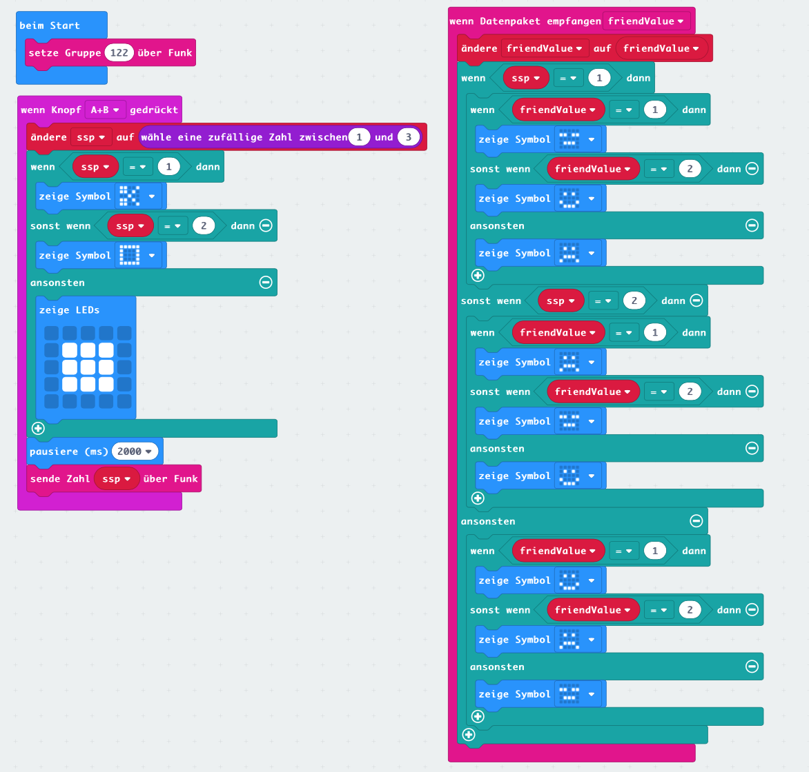

# Lektion 9 - Spiel (Stein,Schere,Papier)

Du hast in den vorherigen Lektionen bereits sehr viel Basiswissen erworben. Es ist nun an der Zeit mit dem Wissen ein erstes kleines Spiel zu programmieren.

Erstelle nun eine elektronische Variante von dem bekannten Spiel _"Stein, Papier, Schere"_, das oft auch _"Schnick, Schnack, Schnuck"_ genannt wird. Beim Schütteln Deines __Micro:Bit__ soll eine zufällige Zahl zwischen __1__ und __3__ ermittelt  und jeweils das zugehörige Symbol angezeigt werden. Die Zuordnung von der Zahlen zu den Symbolen ist wie folgt:

#### Zahl 1 - Stein 

#### Zahl 2 - Papier 

#### Zahl 3 - Schere 

 

## Anleitung

Wähle zunächst aus dem `Eingabe`-Block de Block `wenn geschüttelt` und lösche innerhalb dieses Blocks zunächst das LED-Matrix Display. 

Definiere nun eine  Variable `waffe` und ändere den Wert der Variable auf einen zufällige Wert zwischen __1__ und __3__. Nutze dazu den entsprechenden Block aus dem `Mathematik`-Block.

Jetzt brauchst Du aus dem `Logik`-Block einen `wenn...dann`-Block den Du über das kleine Pluszeichen um zwei weitere `sonst...wenn`-Bedingungen erweiterst. Dieser sollte dann so aussehen:

In den drei Bedingungen musst Du nun über den Vergleich-`Logik`-Block den Wert der Variablen `waffe` einzeln mit den Werten __1__, __2__ und __3__ vergleichen. 

In der `wenn`-Bedingung wird also der Wert der Variablen `waffe` mit dem Wert __1__ auf Gleichheit verglichen und falls diese Bedingung zutrifft, das `Stein`-Symbol angezeigt.

In der ersten `sonst wenn`-Bedingung wird  der Wert der Variablen `waffe` mit dem Wert __2__ auf Gleichheit verglichen und falls diese Bedingung zutrifft, das `Papier`-Symbol angezeigt.

In der zweiten `sonst wenn`-Bedingung wird der Wert der Variablen `waffe` mit dem Wert __3__ auf Gleichheit verglichen und falls diese Bedingung zutrifft, das `Schere`-Symbol angezeigt.

Wenn alles richitg ist, sollte nun beim Schütteln des __Micro:Bit__ zufällig eines der drei Symbole angezeigt werden.

___Let's play ... ___

## Blocks

So könnte Dein Programm aussehen.

## Javascript-Code


    


# Erweiterte Version

Zwei Teilnehmerinnen haben eine erweiterte Version des Programms erstellt, bei dem das jeweilige gewählte Symbol auf den __Micro:Bit__ des anderen Spielers per Funk übertragen wird und dann per Smily angezeigt wird, wer die Runde gewonnen oder verloren hat. Diese Version ist so toll, dass sie hier  veröffentlicht werden muss :)

## Blocks

## Javascript-Code


    


