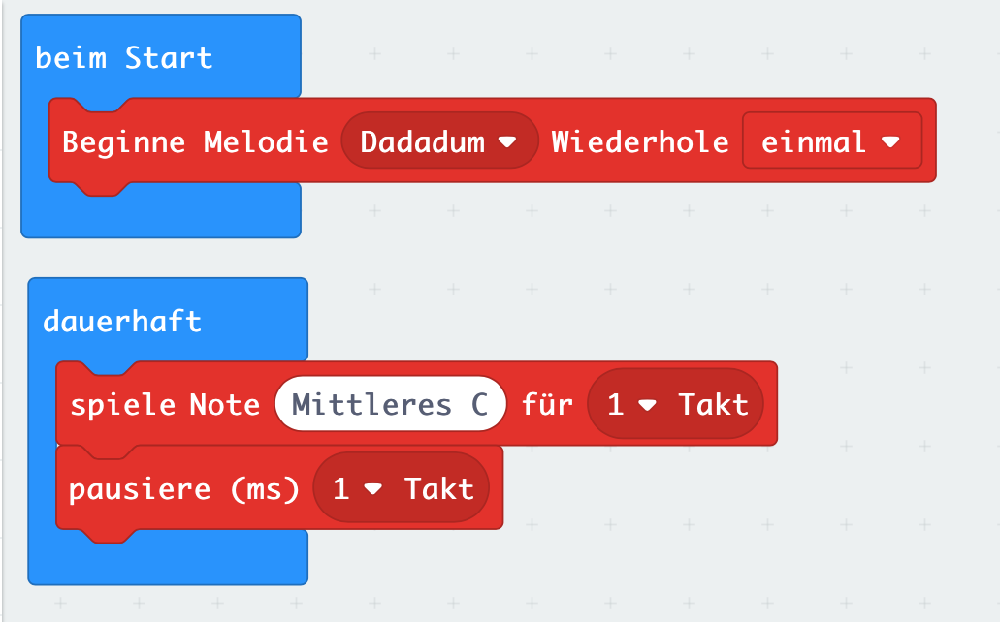

# Lektion 10

## Lautsprecher anschließen 

Schließe einen Lautsprecher an Deinen Micro:Bit an. Verbinde dazu, wie in dem Bild dargestellt, den Anschluß __0__ und __GND__ jeweils mit einer Krokodilklemme mit dem ersten und dem letzten Kontakt des Klinkensteckers Deines Lautsprechers.

Verwende den __beim Start__ Block um beim Einschalten oder Zurücksetzen des Micro:Bit die Melodie __Dadadum__ abzuspielen.

Erstelle zusätzlich eine Endlosschleife (Block __dauerhaft__) in dem Du abwechselnd für __einen Takt__ die Note  __Mittleres C__ abspielst und __einen Takt__ lang eine __Pause__ einlegst.

##### Blocks

