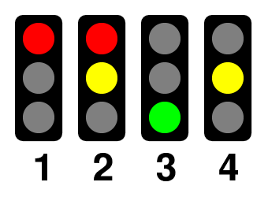

# Lektion 12 - Verkehrsampel

Hardware 
{: .label .label-green }

In dieser Lektion wollen wir eine Verkehrsampel simulieren. Dafür benötigst Du drei LEDs (1x rot, 1x gelb, 1x grün) und drei Widerstände mit 220 Ohm.

Die Verkehrsampel soll die Farben wechseln und dazwischen jeweils Pausen einhalten. In Deutschland folgt eine Ampel dabei folgenden vier Phasen.

Für diese Lektion wählen wir die Länge der Pausen zwischen den Wechseln der einzelnen Phasen mit 2 Sekunden und 5 Sekunden.
Die Phasen 1 und 3 sollen 5 Sekunden dauern.
Die Phasen 2 und 4 sollen 2 Sekunden dauern.

## Anschlüsse 

Die drei LEDs und die Widerstände schließt Du, wie in dem Bild dargestellt, mit Krokodilklemmen an die drei Anschlüsse `1`, `2` und `3` an. Zwischen den Kontakt am __Micro:Bit__ und der LED muss jeweils einer der Widerstände zwischengeschaltet werden.

## Anleitung

Erstelle mit den Blöcken `pausiere` aus dem `Grundlagen`-Block und dem Block `schreibe digitalen Wert` aus dem `Pins`-Block die vier Phasen einer Ampelschaltung.

## Blocks

So könnte Dein Programm aussehen.

## Javascript-Code


    


# Erweiterte Variante

Möchtest Du Deine Verkehrsampel noch besser machen? Dann füge einen Countdown hinzu, der anzeigt wie lange die Grün- und Rot-Phasen jeweils noch dauern.

## Anleitung

Erstelle zunächst zwei Funktionen:

1. Erstelle die Funktion `countdown` und führe zunächst eine Variable `counter` ein, die Du auf den Wert __5__ setzt. Füge nun eine Schleife mit __5__ Schleifendurchläufen hinzu. In jedem Schleifendurchlauf (jeder _Iteration_) soll zunächst der aktuelle Wert der Variablen _counter auf dem LED-Matix-Display des __Micro:Bit__ angezeigt und dann eine Pasue von __1__ Sekunde eingehalten werden. Anschließend wird die Variable um den Wert __1__ verringert (_dekrementiert_). 

2. Erstelle die Funktion `stop`, in der Du einen schrägen Strich auf dem LED-Matrix-Display anzeigst und dann eine Pause von __2__ Sekunden einhälst.

Ersetze nun die Pausen Deines bisherigen Programms durch Aufrufe der beiden Funktionen.

## Blocks

So könnte die erweiterte Variante Deines Programms aussehen.

## Javascript-Code


    

