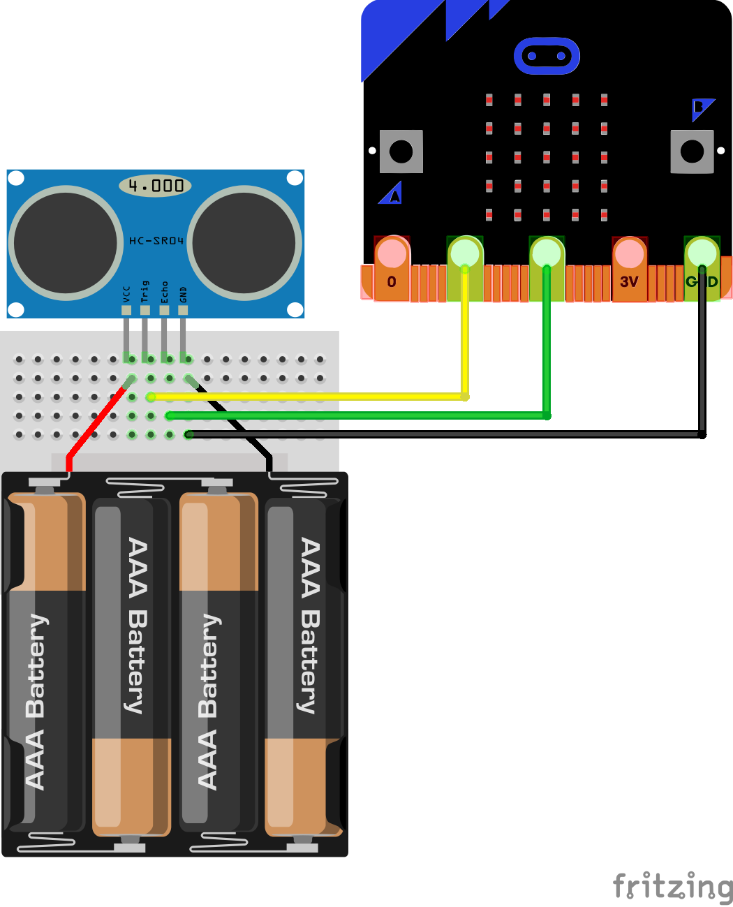
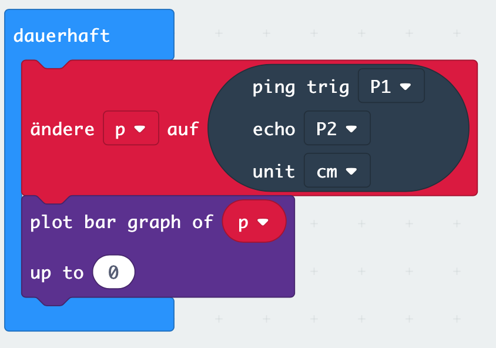

# Lektion 12 - Sonar Sensor 

Hardware
{: .label .label-green }

MakeCode Erweiterung
{: .label .label-yellow }

Ein Sonar-Sensor misst die Entfernung des Sensors zu einem anderen Objekt, z.B. einer Wand. Dafür wird ein unhörbarer Sonar-Ton gesendet und die Zeit gemessen, bis dieser Ton wieder vom Sensor empfangen wird.

In dieser Lektion wollen wir die Entfernung zwischen einem Entfernungssenor und einem beliebigen Objekt (z.B. Wand oder Hand) messen und den Abstand als Balkendiagramm auf dem 5x5 LED-Matrix-Display des Micro:Bit anzeigen.

## MakeCode-Erweiterung

Um einen Sonar-Sensor verwenden zu können, musst Du zunächst Deinen Makecode Editor um die `Sonar` Bibliothek erweitern.

Wähle dazu unter dem Block `Fortgeschritten` den Punkt `Erweiterungen` und suche anschließend nach der `Sonar` Bibliothek. Füge diese dem Makecode Editor hinzu. Dadurch erhälst Du einen weiteren Block.

## Anschlüsse

Schließe jetzt einen Sonar-Sensor wie im folgenden Bild an die Anschlüsse `GND`, `1` und `2` an. Leider benötigen die meisten Ultraschallsensoren eine Spannung von 5V, die 3,3V des Micro:Bit reichen daher nicht aus. Verwende daher eine Batteriebox oder eine andere 5V-Spannungsversorgung.

## Anleitung

Verwende eine Endlosschleife (Block `dauerhaft`) in der Du permanent mit dem Sonar-Block über die Anschlüsse `P1` und `P2` den Sonar-Ton sendest und empfängst. Zeige die Distanz auf in jedem Schleifendurchlauf auf dem LED-Display Deines Micro:Bit als `plot bar` (Balkengrafik) an.

## Blocks

So könnte Dein Programm aussehen.

<!--
## Simulator

<iframe style="position:absolute;top:0;left:0;width:100%;height:100%;" src="https://makecode.microbit.org/---run?id=_870KEKgcKFyc" allowfullscreen="allowfullscreen" sandbox="allow-popups allow-forms allow-scripts allow-same-origin" frameborder="0"></iframe>

-->

## Javascript-Code


    


## Makecode Projekt

https://makecode.microbit.org/#pub:_870KEKgcKFyc