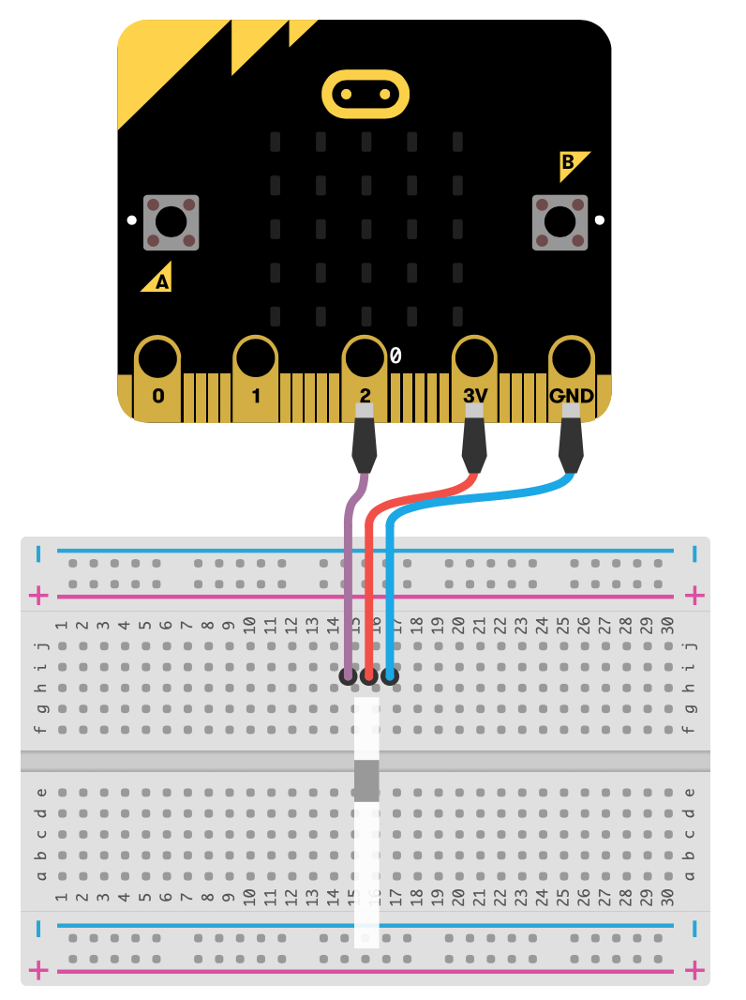

# Lektion 13 - Neopixel 

In dieser Lektion wollen wir spezielle LEDs zum leuchten bringen. Das Spezielle an diesen LEDs ist, dass eine einzelne LED sowohl rot als auch grün als auch blau leuchten kann. Durch Mischung der drei Grundfarben kann jede beliebige Farbe erzeugt werden, ähnlich wie bei einem Farbmalkasten. Diese LED sind unter dem Namen Neopixel bekannt. 

Ziel der Lektion ist es ein einzelnes Neopixel oder einen Streifen von mehreren Neopixeln in den Regenbogenfarben leuchten zu lassen. Dazu wird jedes Pixel nach und nach mit einer anderen Farbe zum leuchten gebracht. Hat ein Pixel alle Farben einmal angezeigt, beginnen wir von vorne.

## MakeCode-Erweiterung

Um Neopixel verwenden zu können, musst Du zunächst Deinen Makecode Editor um die Neopixel Bibliothek erweitern.

Wähle dazu unter dem Block _Fortgeschritten_ den Punkt _Erweiterungen_ und suche anschließend nach der __Adafruit Neopixel__ Bibliothek. Füge diese dem Makecode Editor hinzu. Dadurch erhälst Du einen weiteren Block.

Über diesen neuen Block kannst Du nun Neopixel-LEDs steuern.

## Anschlüsse

Schließe nun eine Neopixel-LED mit drei Krokodilklemmen an Deinen __Micro:Bit__ an. Dabei ist es egal, ob es sich um einen Neopixel-Stick oder eine einzelne Neopixel-LED handelt, die Anschlussart ist gleich.

Für diese Lektion benötigen wir nur drei _"Beinchen"_, die wie folgt angeschlossen werden.

| Neopixel | Micro:Bit | Erklärung|
|---|:---|:---|
|DIN | P2 | Steuerleitung|
|VDD | 3V | Spannungsversorgung (3V-7V)|
|GND | GND | Masseleitung|

## Anleitung

Verwende den _beim Start_ Block um beim Einschalten oder Zurücksetzen des __Micro:Bit__ die Neopixel Bibliothek zu initialisieren, d.h. festzulegen, wieviele Pixel (Anzahl LED) Dein Neopixel hat, an welchem Anschluss Du diesen per Krokodilklemme angeklemmt hast und welche Farben die einzelnen LEDs verwenden können.
Verwende zusätzlich den Block _zeige Regenbogen von Farbton_, der dafür sorgt dass die einzelnen Pixel mit unterschiedlichen Farben belegt werden. Damit die Anzeige aktuallisiert wird, benötigst Du zusätzlich den _anzeigen_ Block. 

Erstelle zusätzlich eine Endlosschleife (Block _dauerhaft_) in der Du die Pixel um jeweils 1 rotierst, die Anzeige aktuallisierst und dann eine Pause von 500 ms machst.

## Blocks

So könnte Dein Programm aussehen.

