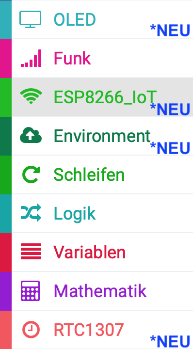
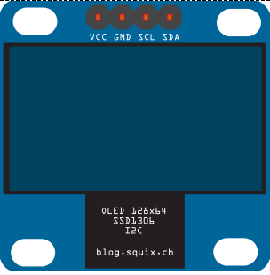
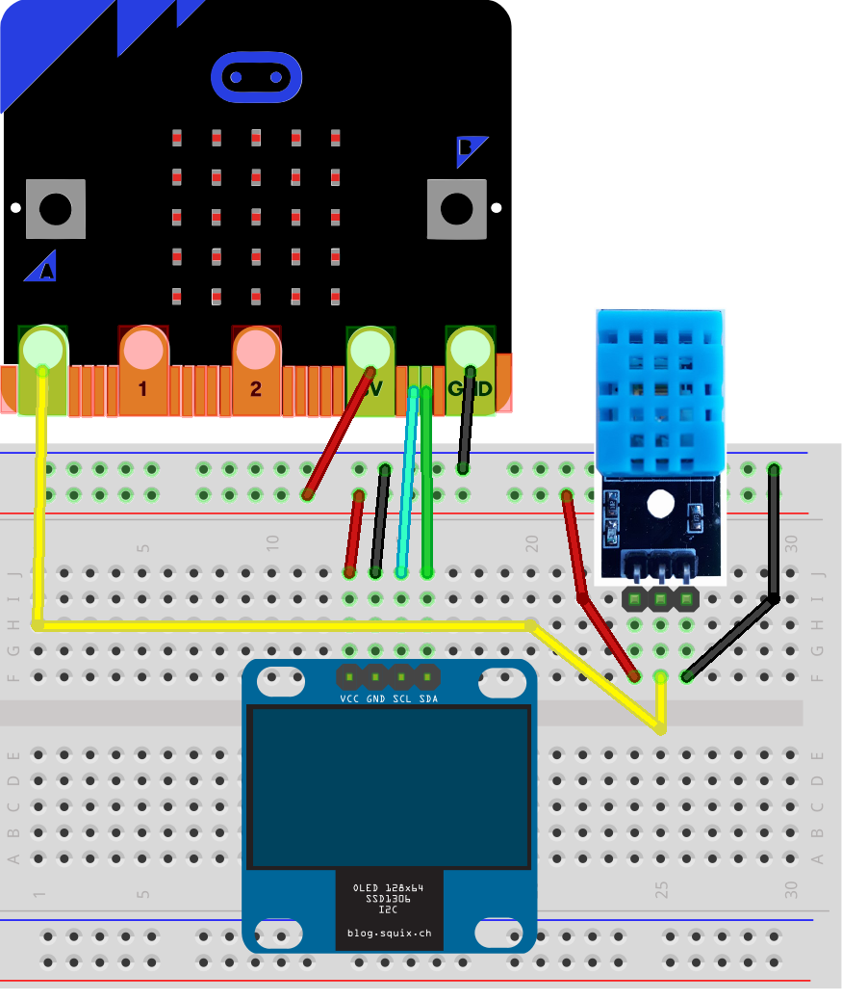
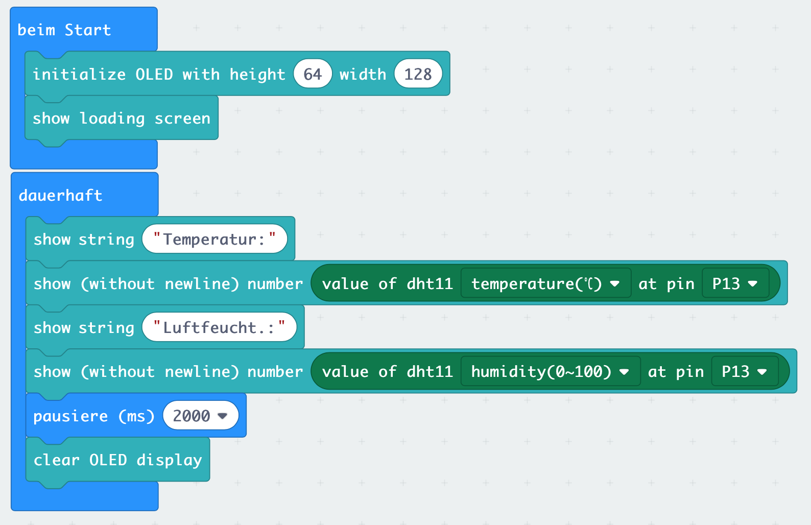

# Lektion 14 - Temperatursensor DHT11 oder DHT22 und OLED

In den vorherigen Lektionen hast Du bereits erfahren, wie Du den MakeCode-Editor für __Micro:Bit__ mit _Erweiterungen_ um noch mehr sinnvolle Funktionen erweitern kannst. In dieser Lektion ließt Du die Temperatur und Luftfeuchtigkeit von einem externen Temperatur- und Feuchtigkeitsensor (DHT11 oder  DHT22) aus und stellst diese auf einem kleinen OLED dar.

## MakeCode-Erweiterung

Um den Sensor mit dem __Micro:Bit__ auslesen zu könnnen, musst Du die __Environment-IoT__-Erweiterung installieren. Diese Erweiterung gehört zu einem speziellen Starter-Set für den __Micro:Bit__ und umfasst unterschiedliche Sensoren. Daher enthält die __Environment-IoT__-Erweiterung viele neuen Blöcke, mit denen Unterschiedliche Sensoren angesteuert werden können, u.a. auch der DHT11-Sensor. 

Wähle  unter dem Block _Fortgeschritten_ den Punkt _Erweiterungen_ und suche anschließend nach der __Environment-IoT__ Bibliothek. Füge diese dem Makecode Editor hinzu. Dadurch erhälst Du folgende weiterer Blöcke.

## Hardware (Sensoren)

### Temperatur- und Feuchtigkeitssensor DHT11

Der hier verwendete Temperatursensor DHT11 verfügt lediglich über drei Anschlüsse und enthält bereits einen Pull-Up-Widerstand. Es gibt auch Modelle, die mit vier Anschlüssen und ohne Widerstand geliefert werden, dort bleibt dann ein PIN unbelegt und es muss zusätzlich ein Widerstand vorgeschaltet werden.

### OLED 64x128 I2C 0,96'' Monochrome Display

Das hier verwendete Display hat eine Größe von 0,96 Zoll, dies entspricht etwa 2,4 cm in der Diagonale. Das OLED kann 64x128 Bildpunkte (Pixel) in einer Farbe (monochrome) darstellen. Angeschlossen wird es über den I2C-Bus, eine Verbindungsart bei der bis zu 127 Geräte gleichzeitig über lediglich zwei Leitungen (SCL und SDA) gesteuert werden können.

## Anschlüsse

Schließe  den Temperatursensor DHT11 oder DHT22 und das OLED wie in folgendem Bild dargestellt an Deinen __Micro:Bit__ an. 

## Anleitung

Du benötigst aus dem _Grundlagen_-Block die Blöcke _beim Start_ und _dauerhaft_.

Im _beim Start_-Block musst Du zunächst Dein OLED korrekt initialisieren, d.h. Du musst dem __Micro:Bit__-Programm mitteilen, wieviele Pixel es in der Höhe und der Breite hat. Verwende  _initialize OLED..._ und setze den Wert _height_ auf 64 und den Wert _width_ auf 128, daraus ergibt sich die _Auflösung_ des Displays. Zusätzlich kannst Du mit _show loading screen_ ein Ladegrafik anzeigen.

Im _dauerhaft_-Block ließt Du jetzt als Endlosschleife die Werte für Temperatur und Luftfeuchtigkeit aus und stellst diese auf dem Display dar.

Gib zunächst die Zeichenkette (String) _"Temperatur:"_ aus, verwende dazu den Block _show string_.

Zeige dann die Temperatur an. Verwede dabei den Block _Show (without newline) number_ und ersetze den Wert mit _value of dht11 temperature_.

Dasselbe machst Du für die Luftfeuchtigkeit. Gib  die Zeichenkette (String) _"Luftfeucht.:"_ aus unter Verwendung des Blocks _show string_ aus. Verwede dnn ebenfalls den Block _Show (without newline) number_ und ersetze den Wert mit _value of dht11 humidity_.

Zum Abschluss füge noch eine Pause von 2 Sekunden hinzu und lösche das Display mit dem Block _clear OLED display_.

Es sollte nun alle 2 Sekunden die aktuelle Temperatur und Luftfeuchtigkeit auf dem OLED angezeigt werden. Hauche vorsichtig den Sensor ab, damit sich die Werte ändern.

## Blocks

So könnte Dein Programm aussehen.

