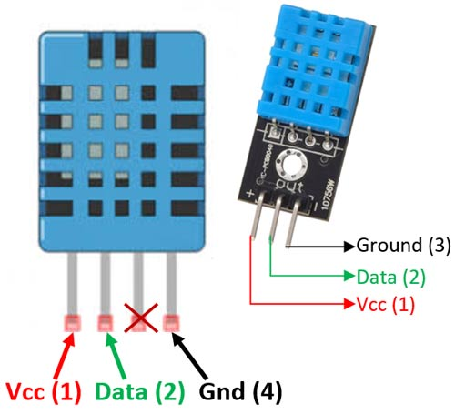

# Lektion 14 - Temperatursensor DHT11 oder DHT22 und OLED

Hardware
{: .label .label-green }

MakeCode Erweiterung
{: .label .label-yellow }

In den vorherigen Lektionen hast Du bereits erfahren, wie Du den MakeCode-Editor für __Micro:Bit__ mit `Erweiterungen` um noch mehr sinnvolle Funktionen erweitern kannst. In dieser Lektion ließt Du die Temperatur und Luftfeuchtigkeit von einem externen Temperatur- und Feuchtigkeitsensor (DHT11 oder  DHT22) aus und stellst diese auf einem kleinen OLED dar.

## MakeCode-Erweiterung

Um den Sensor mit dem __Micro:Bit__ auslesen zu könnnen, musst Du die `Environment-IoT`-Erweiterung installieren. Diese Erweiterung gehört zu einem speziellen Starter-Set für den __Micro:Bit__ und umfasst unterschiedliche Sensoren. Daher enthält die `Environment-IoT`-Erweiterung viele neuen Blöcke, mit denen Unterschiedliche Sensoren angesteuert werden können, u.a. auch der DHT11-Sensor. 

Wähle  unter dem Block `Fortgeschritten` den Punkt `Erweiterungen` und suche anschließend nach der `Environment-IoT` Bibliothek. Füge diese dem Makecode Editor hinzu. Dadurch erhälst Du folgende weiterer Blöcke.

## Hardware (Sensoren)

### Temperatur- und Feuchtigkeitssensor DHT11

Der hier verwendete Temperatursensor DHT11 verfügt lediglich über drei Anschlüsse und enthält bereits einen Pull-Up-Widerstand. Es gibt auch Modelle, die mit vier Anschlüssen und ohne Widerstand geliefert werden, dort bleibt dann ein PIN unbelegt und es muss zusätzlich ein Widerstand vorgeschaltet werden.

### OLED 64x128 I2C 0,96'' Monochrome Display

Das hier verwendete Display hat eine Größe von 0,96 Zoll, dies entspricht etwa 2,4 cm in der Diagonale. Das OLED kann 64x128 Bildpunkte (Pixel) in einer Farbe (monochrome) darstellen. Angeschlossen wird es über den I2C-Bus, eine Verbindungsart bei der bis zu 127 Geräte gleichzeitig über lediglich zwei Leitungen (SCL und SDA) gesteuert werden können.

## Anschlüsse

Schließe  den Temperatursensor DHT11 oder DHT22 und das OLED wie in folgendem Bild dargestellt an Deinen __Micro:Bit__ an. 

## Anleitung

Du benötigst aus dem `Grundlagen_`-Block die Blöcke `beim Start` und `dauerhaft`.

Im `beim Start`-Block musst Du zunächst Dein OLED korrekt initialisieren, d.h. Du musst dem __Micro:Bit__-Programm mitteilen, wieviele Pixel es in der Höhe und der Breite hat. Verwende  `initialize OLED...` und setze den Wert `height` auf __64__ und den Wert `width` auf __128__, daraus ergibt sich die `Auflösung` des Displays. Zusätzlich kannst Du mit `show loading screen` ein Ladegrafik anzeigen.

Im `dauerhaft`-Block ließt Du jetzt als Endlosschleife die Werte für Temperatur und Luftfeuchtigkeit aus und stellst diese auf dem Display dar.

Gib zunächst die Zeichenkette (String) _"Temperatur:"_ aus, verwende dazu den Block `show string`.

Zeige dann die Temperatur an. Verwede dabei den Block `Show (without newline) number` und ersetze den Wert mit `value of dht11 temperature`.

Dasselbe machst Du für die Luftfeuchtigkeit. Gib  die Zeichenkette (String) _"Luftfeucht.:"_ aus unter Verwendung des Blocks `show string` aus. Verwede dnn ebenfalls den Block `Show (without newline) number` und ersetze den Wert mit _`alue of dht11 humidity`.

Zum Abschluss füge noch eine Pause von __2__ Sekunden hinzu und lösche das Display mit dem Block `clear OLED display`.

Es sollte nun alle __2__ Sekunden die aktuelle Temperatur und Luftfeuchtigkeit auf dem OLED angezeigt werden. Hauche vorsichtig den Sensor ab, damit sich die Werte ändern.

## Blocks

So könnte Dein Programm aussehen.

## Javascript-Code


    

