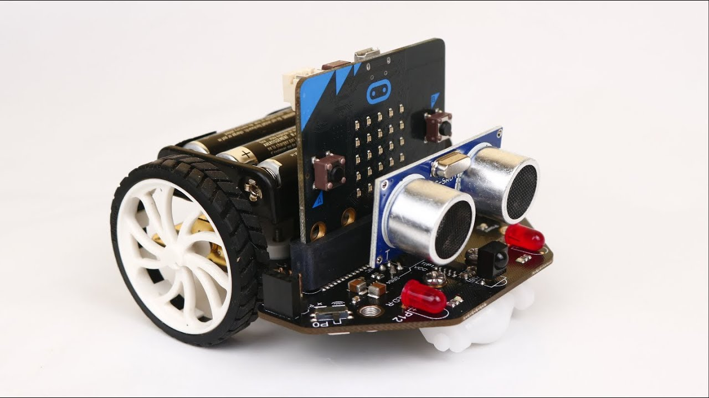

# Maqueen

Hardware
{: .label .label-green }

MakeCode Erweiterung
{: .label .label-yellow }

Beim Maqueen handelt es sich um einen kleinen Roboter der Firma DFRobot, der mittels eines Micro:Bit programmiert werden kann.

Der Roboter erweitert den Micro:Bit um weitere Sensoren und elektrische Bauteile.

- 2 LEDs
- 4 Neopixel RGB LEDs
- Infrarot-Sensor
- Ultraschall-Entfernungssensor
- Linienfolgemodul
- zwei Motoren
- Piezo-Buzzer (Lautsprecher)

## Maqueen mit Makecode

Um den Maqueen Roboter programmieren zu können, musst Du zunächst Deinen Makecode Editor um die Maqueen Bibliothek erweitern.

Wähle dazu unter dem Block _Fortgeschritten_ den Punkt _Erweiterungen_ und gib in das Suchfeld folgende Adresse ein: 

https://github.com/DFRobot/pxt-maqueen

Füge diese dem Makecode Editor hinzu. Dadurch erhälst Du einen weiteren Block.

Über diesen neuen Block kannst Du alle Funktionen des Maqueen Roboters steuern.

