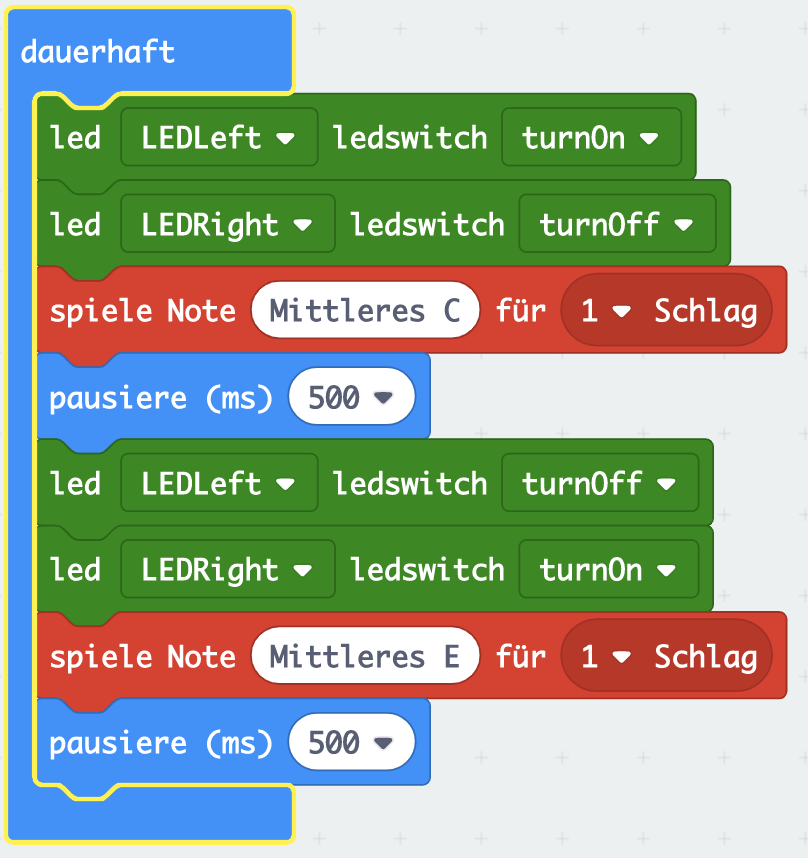

# Maqueen LED und Piezo-Buzzer (Lautsprecher)

Der Maqueen hat zwei einfache LEDs an seiner Front. Diese können über MakeCode einfach angesprochen werden. Zusätzlich verfügt der Maqueen Roboter über einen sehr einfachen Lautsprecher in Form eines Piezo-Buzzers.

In dieser Lektion sollen die LEDs zum blinken gebracht und zusätzlich Töne ausgegeben werden.

## Anleitung

Nutze aus dem Bereich der Maqueen-Blöcke den Block um eine LED ein- oder auszuschalten und schalte abwechselnd, mit jeweils 500ms Pause dazwischen, eine LED ein und gleichzeitig die andere aus.
Spiele zusätzlich bei jedem Wechsel einen Ton. Verwende dazu aus den Musik-Blöcken den Block "spiele Note".

## Blocks

So könnte Dein Programm aussehen.

## Ergebnis (Simulation)

<iframe style="position:absolute;top:0;left:0;width:100%;height:100%;" src="https://makecode.microbit.org/---run?id=_UtwMxDCpd6g2" allowfullscreen="allowfullscreen" sandbox="allow-popups allow-forms allow-scripts allow-same-origin" frameborder="0"></iframe>

## Javascript-Code


    


## MakeCode Projekt

https://makecode.microbit.org/_UtwMxDCpd6g2
