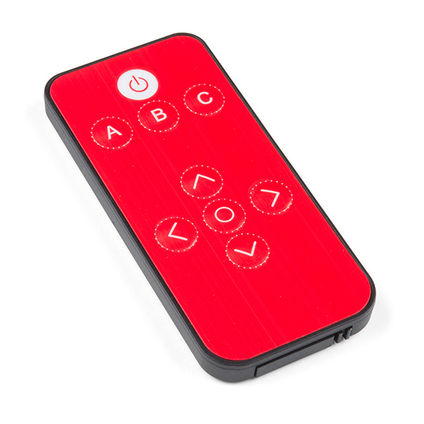
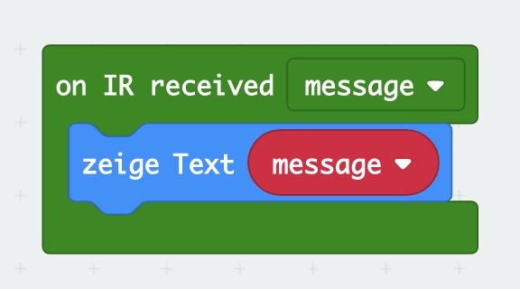
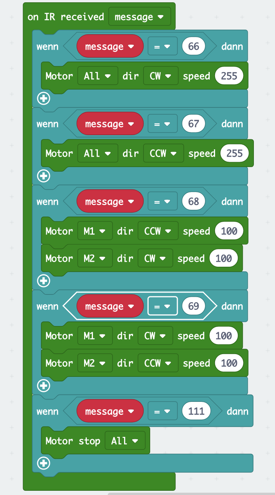

# Maqueen - Infrarot gesteuert

## Infrarot Codes ermitteln

Für diese Lektion benötigst Du eine Infrarot-Fernbedienung, die sogenannte Graycodes sendet. Die meisten Fernbedienungen funktionieren auf diese Weise, daher sollte in jedem Haushalt eine geeignete Fernbedienung zu finden sein.
Um den Roboter mit der IR-Fernbedienung steueren zu können, musst Du Dir zunächst 5 Tasten auf der Fernbedienung aussuchen.



Die Fernbedienung in dem Bild hat vier Pfeile und einen Kreis, die wir verwenden können. Hat Deine Fernbedienung nur Zahlen, kannst Du z.B. die Zahlen __`2`__, __`4`__, __`5`__, __`6`__ und __`8`__ verwenden, die in der gleichen Art angeordnet sind.

Um die gesendeten Codes der jeweiligen Tasten zu ermitteln, benötigst Du aus dem Maqueen-Blöcken den Block "on IR received". In diesem Block gibst Du einfach den empfangenen Code mit dem Block __`zeige Text`__ auf dem LED-Display des __Micro:Bit__ aus.

Notiere Dir die Codes in einer Tabelle, etwa so wie hier für das oben abgebildete Exemplar.

| Taste | Code | Funktion  |
| :---:| :---:| :---:|
| Pfeil hoch | 66 | fahre vorwärts |
| Pfeil runter | 67 | fahre rückwärts |
| Pfeil links | 68 | drehe links |
| Pfeil rechts | 69 | drehe rechts |
| Kreis | 111 | stop |

### Blocks

So könnte Dein Programm aussehen.



### Javascript-Code


    


## Maqueen per IR-Ferbedienung steuern

Wenn Du die Codes der IR-Fernbedienung ermittelt und notiert hast, kannst Du nun auf die entsprechenden Codes reagieren und die Motoren des Roboters entsprechend bewegen.

Dazu benötigst Du zunächst wieder den __`on IR receiced`__ Block aus dem Maqueen-Blöcken. Zusätzlich benötigst Du fünf "Wenn ... dann"-Blöcke aus den Logik-Blöcken und fünf "="-Blöcke aus den Mathematik-Blöcken.

Prüfe nun jeweils in einen __`wenn ... dann`__-Block auf die jeweiligen Codes der Fernbedienung. In dem __`wenn ... dann`__ Block kannst Du die Motoren des Maqueen steuern. Verwende dazu die __`Motor ... dir ... speed`__-Blöcke aus den Maqueen-Blöcken.

Hier ein Beispiel:

Wenn z.B. der Code __`66`__ empfangen wird, soll der Maqueen mit maximaler Geschwindigkeit nach vorne fahren. Dazu benötigen wir den Block __`Motor ... dir ... speed`__ und setzen die Werte wie folgt:

```
Motor "All" dir "CW" speed "255"
```

### Blocks

So könnte Dein Programm aussehen.



### Ergebnis (Simulation)


### Javascript-Code


    


### MakeCode Projekt

https://makecode.microbit.org/_WFTMKdAAxXat