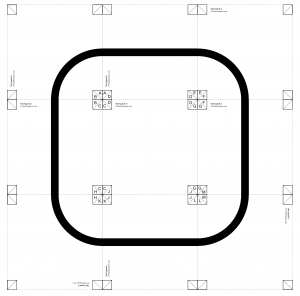
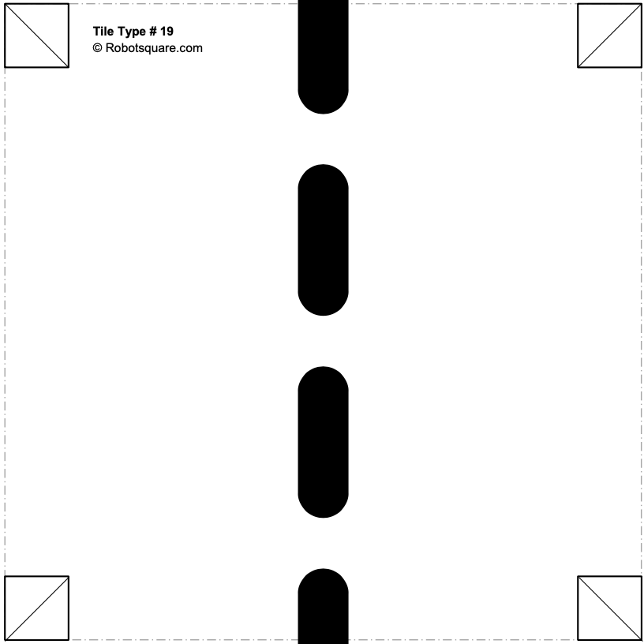
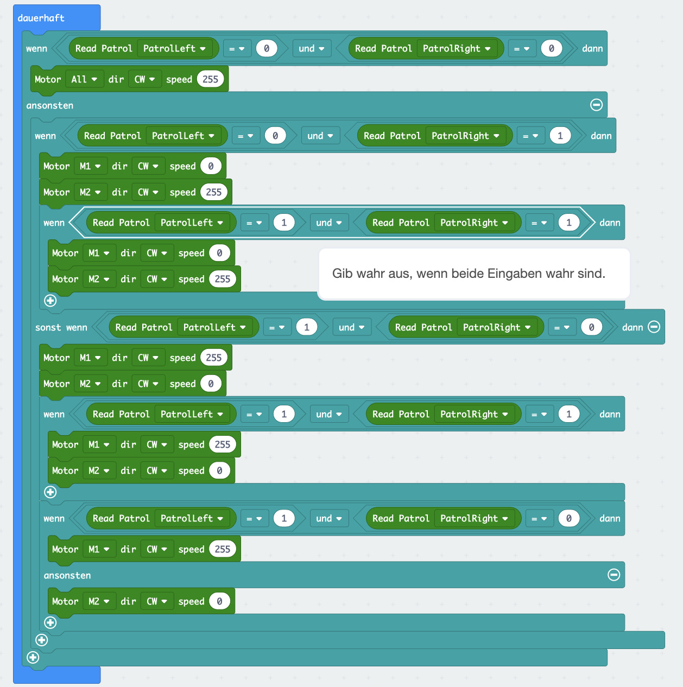

# Maqueen - Linien folgen

In dieser Lektion kannst Du dem Maqueen Roboter beibringen Linien zu folgen. An der Unterseite des Roboters befinden sich zwei Infrarot-Sender und -Empfänger, die dem Roboter ermöglichen dunkle und helle Flächen voneinander zu unterscheiden. Dunkle Flächen erkennt der Maqueen als Wert __`0`__. Helle Flächen erkennt der Roboter als Wert __`1`__. 

## Anleitung

Starte zunächst damit Dir einen Kurs auszudenken und mit folgender Druckvorlage entsprechende Streckenabschnitte auszudrucken. Achte dabei darauf, dass es keine Unterbrechungen in Deiner Strecke gibt, diese führen dazu das der Roboter anhält und nicht weiter fahren kann.

[Druckvorlagen für individuelle Linienfolger-Parcours](http://robotsquare.com/wp-content/uploads/2012/11/linefollowtiles.pdf)

Nachdem Du alle notwendigen Streckenabschnitte ausgedruckt hast, klebe diese mit Klebestreifen oder einem Klebestift entsprechend Deiner Vorlage aneinander. Hier ein einfaches Beispiel, wie Deine Strecke aussehen könnte.

Anschließend kannst Du dem Maqueen beibringen, der schwarzen Linie zu folgen.
Dazu benötigst Du aus dem Maqueen-Blöcken die Blöcke `Read Patrol` und `Motor ... dir ... speed`. Aus den Logik-Blöcken benötigst Du zudem den Block `wenn ... dann`.

In einer Endlosschleife ließt Du bei jedem Durchgang die Werte für den linken `PatrolLeft`und den rechten `PatrolRight` Linienfolgesensor aus.

Nun benötigst Du einige Fallunterscheidungen, die Du mit mehreren `wenn ... dann ... ansonsten`-Blöcken abbilden kannst.

Unterscheide zunächst ob sich der Roboter mit beiden Sensoren auf der Linie befindet.

 _Fall 1:_ Beide Sensoren messen einen dunklen Bereich (Wert `0`), d.h. beide Sensoren sind auf der Linie. In diesem Fall soll der Roboter geradeaus fahren, es müssen also beide Motoren (`M1`und `M2`) mit derselben Geschwindigkeit vorwärts fahren. Dies kann z.B. der Wert `255`für maximale Geschwindigkeit sein.

Unterscheide anschließend (in dem `ansonsten`-Block) folgende Fälle.

_Fall 2:_ Der linke Sensor erfasst einen dunklen Bereich und der rechte Sensor einen hellen Bereich. In diesem Fall macht entweder die Strecke eine Linkskurve oder der Roboter ist nach rechts von der Linie abgekommen. In diesem Fall schalten wir den linken Motor `M1` ab, d.h. wir setzen die Geschwindigkeit auf den Wert `0`. 

_Fall 3:_ Der linke Sensor erfasst einen hellen Bereich und der rechte Sensor einen dunklen Bereich. In diesem Fall macht entweder die Strecke eine Rechtskurve oder der Roboter ist nach links von der Linie abgekommen. In diesem Fall schalten wir den rechten Motor `M2` ab, d.h. wir setzen die Geschwindigkeit auf den Wert `0`. 

_Fall 4:_ Wenn beide Sensoren den Wert `1` aufweisen, ist der Roboter von der Strecke abgekommen oder die Strecke weist eine Unterbrechung auf. In diesem Fall soll der Roboter anhalten, dies erreichst Du indem Du beide Motoren stoppst. 

Der Maqueen-Roboter sollte nun schon in der Lage sein einer Linie zu folgen, allerdings hat die einfache Unterscheidung der vier Fälle einige Nachteile. Kannst Du herausfinden welche und das Programm verbessern?

___Zusatzaufgabe___

Bei den ausgedruckten Streckebabschnitten findest Du auch Abschnitte mit Verzweigungen, Kreuzungen oder Unterbrechungen. Eine Unterbrechung in der Strecke führt z.B., in unserem einfachen Programm, zum Anhalten des Roboters. Dieser muss dann von Hand auf einen anderen Abschnitt der Strecke gesetzt werden. 

Beispiel für eine Unterbrechung: 

Kannst Du das Programm verbessern, so dass der Roboter auch mit Kreuzungen, Unterbrechungen und anderen problematischen Situationen zurecht kommt und weiter fährt?

## Blocks

So könnte Dein Programm aussehen.

<!--    
## Ergebnis (Simulation)

<iframe style="position:absolute;top:0;left:0;width:100%;height:100%;" src="https://makecode.microbit.org/---run?id=_JxXi97fapFwf" allowfullscreen="allowfullscreen" sandbox="allow-popups allow-forms allow-scripts allow-same-origin" frameborder="0"></iframe>

-->

## Javascript-Code


    


## MakeCode Projekt

[Maqueen Lektion 3 - Linien folgen](https://makecode.microbit.org/_JxXi97fapFwf)
