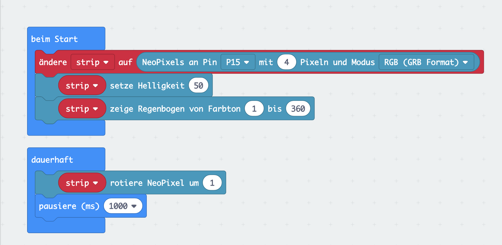

# Maqueen Neopixel

## Anleitung

### Erweiterung installieren

Für diese Lektion benötigst Du eine spezielle `Neopixel`-Erweiterung, die Du dem Projekt hinzufügen musst. 

## Blocks

So könnte Dein Programm aussehen.

## Javascript-Code


    


## MakeCode Projekt

https://makecode.microbit.org/_9Ys0MV27Wc0f