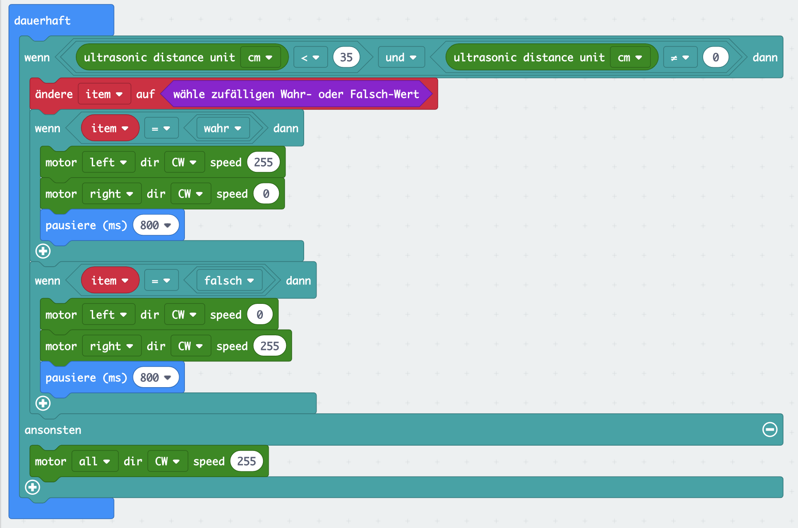

# Maqueen - Hindernissen ausweichen

In dieser Lektion soll der Maqueen selbstständig Hindernisse erkennen und diesen ausweichen. Dazu nutzen wir den Ultraschallsensor um die Entfernung zum nächsten Objekt vor dem Roboter zu messen.

## Anleitung

Lies in einer Dauerschleife den Entfernungswert des Ultraschallsensors und prüfe ob dieser ungleich `0` und kleiner `35 cm` ist. Ist dies der Fall, ist entweder der Sensor nicht korrekt angebracht oder der Roboter ist näher als 35 cm an einem Objekt und muss ausweichen. Ansonsten kann der Roboter mit voller Geschwindigkeit geradeaus nach vorne fahren.

Bevor der Roboter einem Hinderniss ausweichen soll, bestimme zunächst zufällig ob er sich nach rechts oder links dreht. Weise dazu einer neuen Variablen `rechtsDrehung` einen zufälligen `Wahr` oder `Falsch` Wert zu. Den entsprechenden `wähle zufälligen Wahr- oder Falsch-Wert`-Block findest Du bei den `Mathematik`-Blöcken.

Füge nun zwei `wenn ... dann`-Blöcke ein, in denen Du zwischen den Werten `Wahr` und `Falsch` der Variablen `rechtsDrehung` unterscheidest. Enthält die Variable `rechtsDrehung` den Wert `Wahr` soll der Roboter nach rechts ausweichen. Enthält sie hingegen den Wert `Falsch`soll der Roboter nach links ausweichen. 
Um dies zu erreichen, musst Du - je nach Richtung - den linken oder rechten Motor für etwa 800 Millisekunden anhalten, während der andere Motor mit voller Geschwindigkeit vorwärts fährt.

Der Roboter sollte nun solange geradeaus fahren, bis er einem Objekt näher als 35 cm kommt. Dann sollte er mit einer zufällig gewählten, kurzen Rechts- oder Linksdrehung ausweichen und anschließend weiter geradeaus fahren.

## Blocks

So könnte Dein Programm aussehen.

<!--
## Ergebnis (Simulation)
-->

## Javascript-Code


    


## MakeCode Projekt

[Maqueen Lektion 5 - Hindernissen ausweichen](https://makecode.microbit.org/_L381h9bWu5i4)