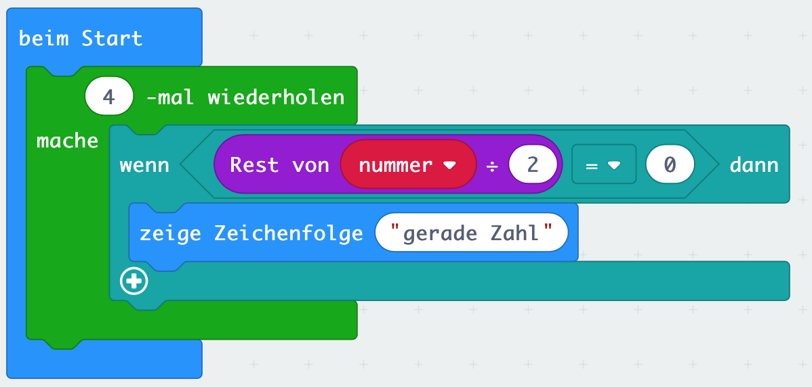
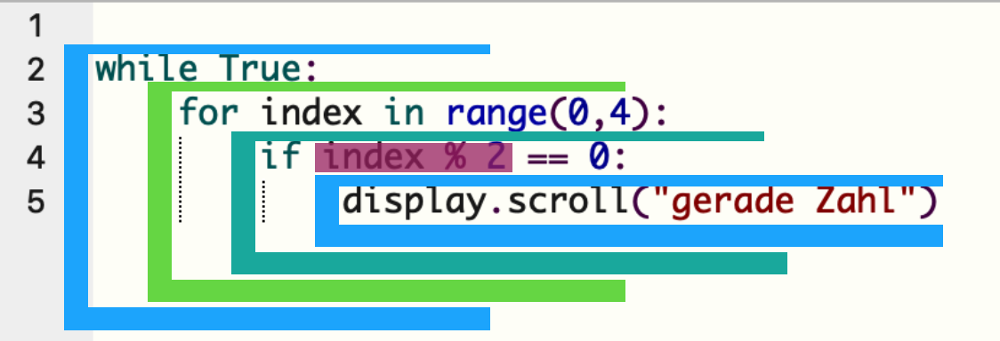

# Einleitung

## Python Syntax

Die meisten Programmiersprachen nutzen zur Gliederung geschweifte Klammern. Python hingegen ist eine Sprache, die den Code durch Einrückung gliedert. Dies ist der Programmierung mit Blöcken recht ähnlich, wie folgendes Beispiel zeigt.

##### MakeCode Blocks



##### Python



## Python Sprachelemente

### Variablen


### Schleifen

#### while-Schleife

```python
while <bedingung>:
    Anweisung_1
    Anweisung_2
    ...
    Anweisung_n
````

#### for-Schleife

```python
for <variable> in <sequenz>:
    Anweisung_1
    Anweisung_2
    ...
    Anweisung_n
```

### Bedingungen

#### if-Bedingung

```python
if <bedingung_1>:
    Anweisung_1
elif <bedingung_2
    Anweisung_2
else
    Anweisung_3
```

### Funktionen