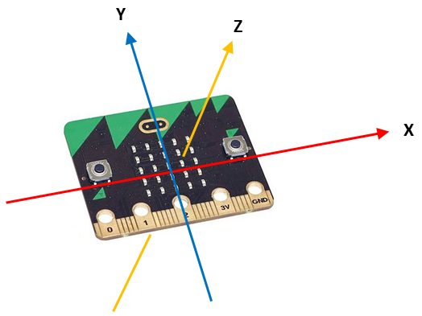
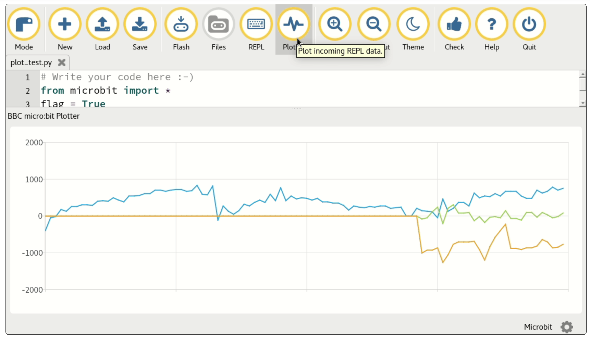

# Lektion 3 - Messdaten anzeigen

Die Programmierung des __Micro:Bit__ mit dem MU-Editor hat ein paar schöne Nebeneffekte. In diese Lektion ließt Du nicht nur die Werte des Beschleunigungssensor aus, Du stellst sie auch direkt mit der `Plotter`-Funtion des MU-Editors grafisch dar.

## Harware - Beschleunigungssensor (Accelerometer)

Der BEschleunigungssensor des __Micro:Bit__ ist in der Lage die Bewegung in drei Richtungen gleichzeitig zu erfassen. Die drei Richtungen werden als X für die Bewegung der Platina nach rechts und links, Y für die Bewegung nach vorne und hinten und Z für die Bewegung hoch und runter bezeichnet.



Es ist möglich jeden der drei Werte einzeln oder alle drei Werte gemeinsam abzufragen. Dies geschieht über Funktionen des `accellerometer`-Objektes der `microbit`-Bibliothek.

## Anleitung

Importiere zunächst die notwendige `microbit`-Bibliothek, wie in den bisherigen Lektionen auch und erstelle dann Variable mit dem Namen `flag`.

```python
flag = True
```

Erstelle als nächstes eine Endlosschleife, wie in der vorherigen Lekttion. In der Endlosschleife soll zunächst eine Pause von 20 Millisekunden (ms) eingehalten werden. Dies ist notwendig, damit der Sensor nicht zu schnell hintereinander ausgelesen wird.
Prüfe anschließend in einer `if`-Bedingung, ob der Knopf `A` gedrückt wurde. Ist dies der Fall, invertiere den Wert der Variablen `flag`.

```python
sleep(20)
if button_a.was_pressed():
    flag = not flag
 ```

Unterscheide nun, ebenfalls in der Endlosscheife, ob die Variable `flag` den Wert __TRUE__ oder __FALSE__ aufweißt.

Falls die Variable den Wert __TRUE__ enthält, lese mittels der Funktion `accelerometer.get_x()` die Neigung des __Micro:Bit__ in der horizontalen Richtung aus und gib dies mit der `print`-Funktion aus,

Falls die Variable den Wert __FALSE____ enthält, lese mittels der Funktion `accelerometer.get_values()` alle drei Beschleunigungswerte des __Micro:Bit__ aus und gebe dies mittels der `print`-Funktion aus.

```python
if flag:
    print((accelerometer.get_x(), ))
else:
    print(accelerometer.get_values())
```

## Python-Code


    


## Graphen-Darstellung der Werte

Jetzt kannst Du Dir die gemessenen Werte dee Beschleunigungssensors als Graph anzeigen lassen. Klicke dazu im MU-Editor auf die Schaltfläche __Plotter__.

Bewege nun Deinen __Micro:Bit__ und schaue was angezeit wird. Drücke im Abstand von mehreren Sekunden immer mal wieder den Knopf `A`. Was beobachtest Du?



## Dokumentationen

[Accelerometer-Object (Englisch)](https://microbit-micropython.readthedocs.io/en/latest/accelerometer.html)