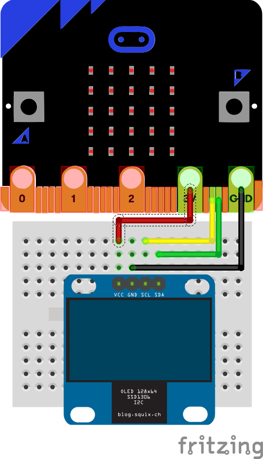

# Lektion 10 - OLED anschließen 

## Hardware

In diese Lektion schließt Du an Deinen __Micro:Bit__ ein zusätzliches OLED an.

### OLED 64x128 I2C 0,96'' Monochrome Display

Das hier verwendete Display hat eine Größe von 0,96 Zoll, dies entspricht etwa 2,4 cm in der Diagonale. Das OLED kann 64x128 Bildpunkte (Pixel) in einer Farbe (monochrome) darstellen. Angeschlossen wird es über den I2C-Bus, eine Verbindungsart bei der bis zu 127 Geräte gleichzeitig über lediglich zwei Leitungen (SCL und SDA) gesteuert werden können.


## Anschlüsse

Schließe nun das OLED wie in dem Bild unten an. 



Die Belegung in tabellarischer Form.

| OLED | Micro:bit | Beschreibung |
| --- | --- | --- |
| VCC | 3V | Spannungsversorgung |
| GND | GND | Masseleitung |
| SCL | Pin 19 (SCL) | Signal Clock |
| SDA | Pin 20 (SDA) | Signal Data |

## Anleitung

Lade zunächst die Bibliothek für das SSD1306 Display auf Deinen __Micro:Bit__.

Anschließend musst Du die Bibliothek importieren, damit Du im Code die Funktionen nutzen kannst.

```js
from ssd1306 import draw_screen, initialize, clear_oled
from ssd1306_text import add_text
```

Bevor wir das OLED im Programm nutzen können, muss erst noch das Display initialisiert werden. Dazu dient die Methode initialize.

```js
initialize()
````

Jetzt kannst Du das Display ansprechen und z.B. Text darstellen. Dieser wird allerdings nicht direkt angezeigt. Die Bibliothek puffert den Text erst in einem Zwischenspeicher.

```js
add_text(2, 1, "Hello")
add_text(2, 3, "World!")
```

Die  beiden Zeilen schreiben Text an den angegebenen Positionen auf das Display. 

Erst die Methode draw_screen() sorgt dafür, dass dieser Text tatsächlich auf dem OLED angezeigt wird.

```js
draw_screen()
```

## Python-Code


    


## Verwendete Bibliotheken

- [SSD1306](https://github.com/fizban99/microbit_ssd1306)

## Beispiele

- [0,96'' OLED](https://www.littlebird.com.au/learn/77/0-96-oled-screen-with-micro-bit)