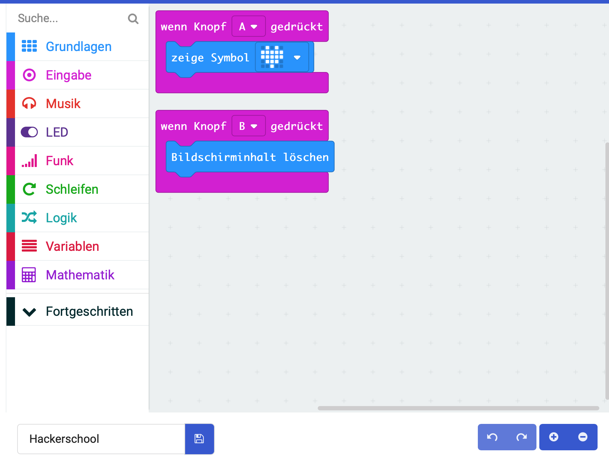

# Lektion 2

## Buttons (Knöpfe)

Verwende die beiden Button (Knöpfe) Deines Micro:Bit um über den Knopfdruck ein Ereignis auszulösen. 

#### Coding

Nutze die beiden Button Deines Micro:bit um abwechselnd ein Icon anzuzeigen und zu löschen.
Du benötigst dazu Blöcke aus dem _Eingabe_-Block.

Bei Druck auf den Button __A__ wird ein Herz angezeigt.

Bei Druck auf den Button __B__ der Bildschirm wieder gelöscht

#### Blocks

