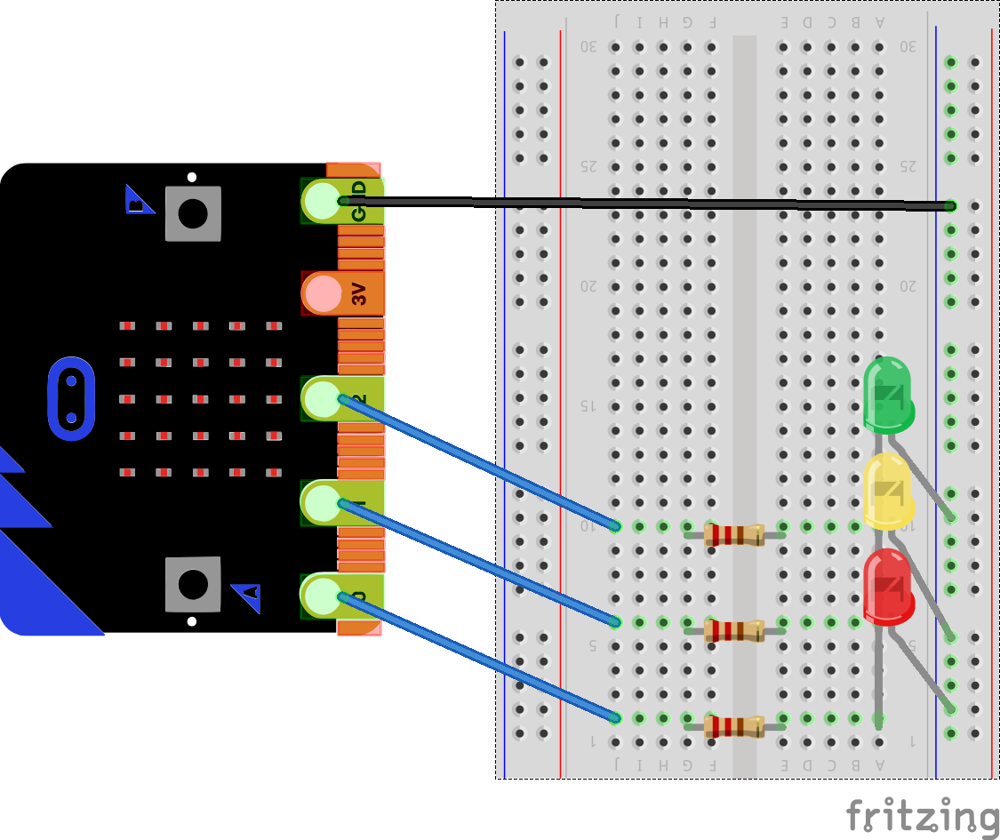

# Lektion 12

## Verkehrsampel

Für die Verkehrsampel benötigst Du drei LEDs (1x rot, 1x gelb, 1x grün) und drei Widerstände mit 220 Ohm.
Die drei LEDs und die Widerstände schließt Du wie in dem Bild dargestellt mit Krokodilklemmen an die drei Anschlüsse __1__, __2__ und __3__ an. 

ToDo