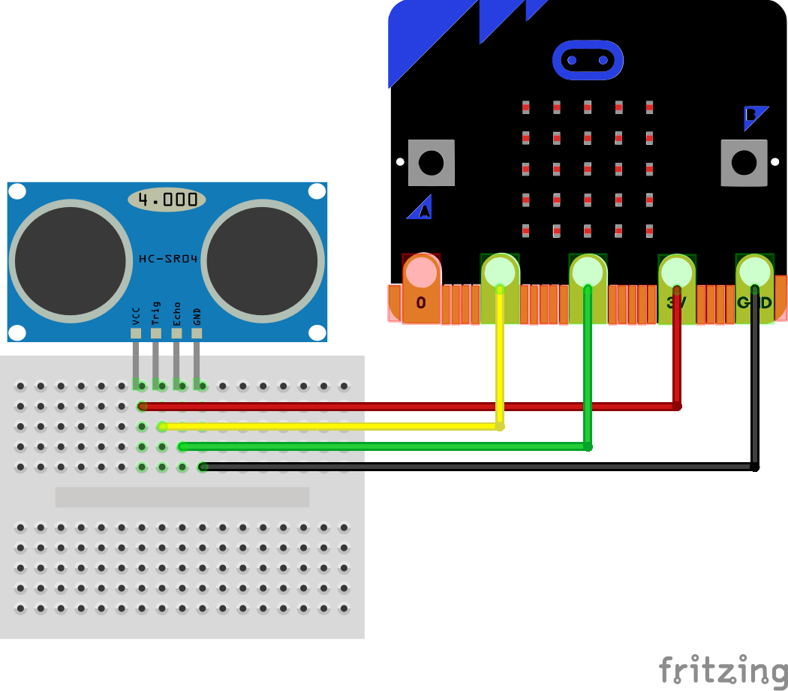
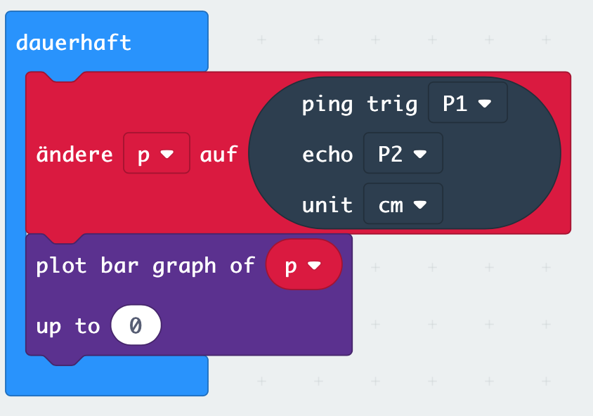

# Lektion 11

## Sonar Sensor 

Ein Sonar-Sensor misst die Entfernung des Sensors zu einem anderen Objekt, z.B. einer Wand. Dafür wird ein unhörbarer Sonar-Ton gesendet und die Zeit gemessen, bis dieser Ton wieder vom Sensor empfangen wird.

Um einen Sonar-Sensor verwenden zu können, musst Du zunächst Deinen Makecode Editor um die __Sonar__ Bibliothek erweitern.

Wähle dazu unter dem Block _Fortgeschritten_ den Punkt _Erweiterungen_ und suche anschließend nach der __Sonar__ Bibliothek. Füge diese dem Makecode Editor hinzu. Dadurch erhälst Du einen weiteren Block.

Schließe jetzt einen Sonar-Sensor wie im folgenden Bild an die Anschlüsse __GND__, __3V__, __1__ und __2__ an.

Verwende eine Endlosschleife (Block __dauerhaft__) in der Du permanent mit dem Sonar-Block über die Anschlüsse __P1__ und __P2__ den Sonar-Ton sendest und empfängst. Zeige die Distanz auf in jedem Schleifendurchlauf auf dem LED-Display Deines Micro:Bit als __plot bar__ (Balkengrafik) an.

##### Blocks

