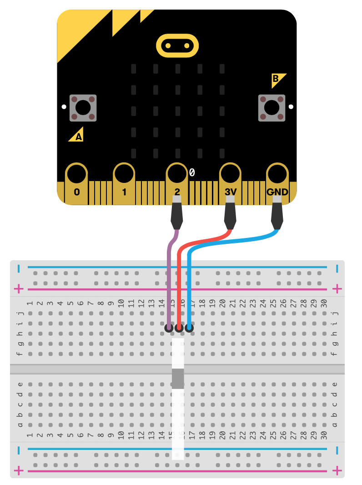
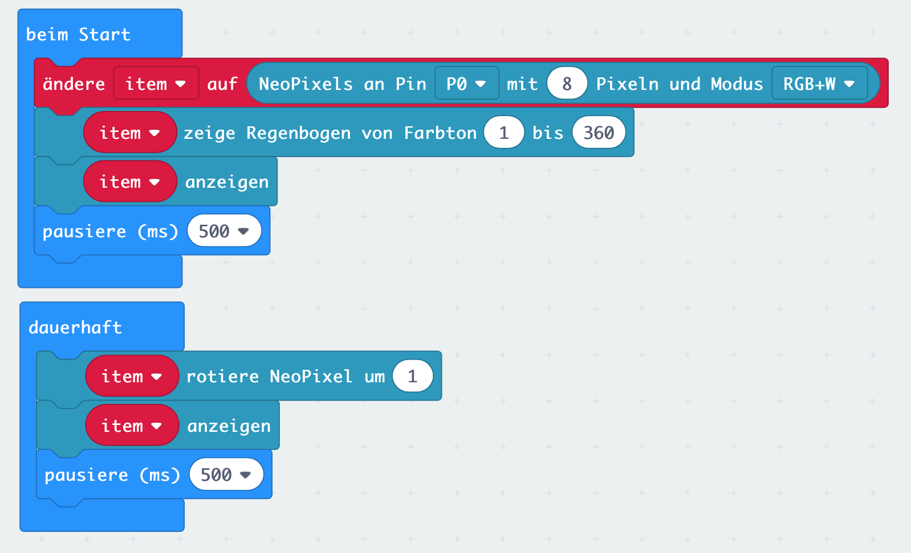

# Lektion 13

## Neopixel 

In dieser Lektion wollen wir spezielle LEDs zum leuchten bringen, die rot, grün und blau leuchten können. Diese sind unter dem Namen Neopixel bekannt. 

Um Neopixel verwenden zu können, musst Du zunächst Deinen Makecode Editor um die Neopixel Bibliothek erweitern.

Wähle dazu unter dem Block _Fortgeschritten_ den Punkt _Erweiterungen_ und suche anschließend nach der __Adafruit Neopixel__ Bibliothek. Füge diese dem Makecode Editor hinzu. Dadurch erhälst Du einen weiteren Block.

Über diesen neuen Block kannst Du nun Neopixel-LEDs steuern.

Schließe nun eine Neopixel-LED wie im folgenden Bild mit drei Krokodilklemmen an Dein Micro:Bit an.

Verwende den __beim Start__ Block um beim Einschalten oder Zurücksetzen des Micro:Bit die Neopixel Bibliothek zu initialisieren, d.h. festzulegen, wieviele Pixel (Anzahl LED) Dein Neopixel hat, an welchem Anschluss Du diesen per Krokodilklemme angeklemmt hast und welche Farben die einzelnen LEDs verwenden können.
Verwende zusätzlich den Block __zeige Regenbogen von Farbton__, der dafür sorgt dass die einzelnen Pixel mit unterschiedlichen Farben belegt werden. Damit die Anzeige aktuallisiert wird, benötigst Du zusätzlich den __anzeigen__ Block. 

Erstelle zusätzlich eine Endlosschleife (Block __dauerhaft__) in der Du die Pixel um jeweils 1 rotierst, die Anzeige aktuallisierst und dann eine Pause von 500 ms machst.

##### Blocks

