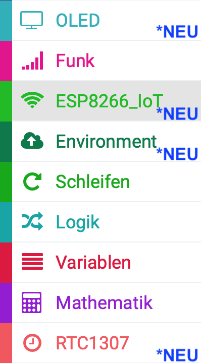
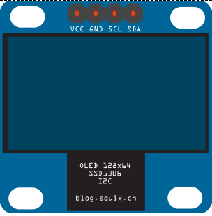
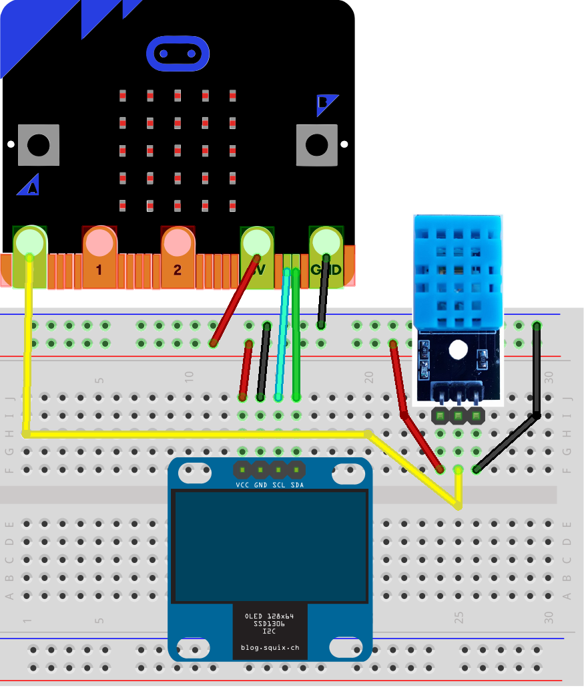
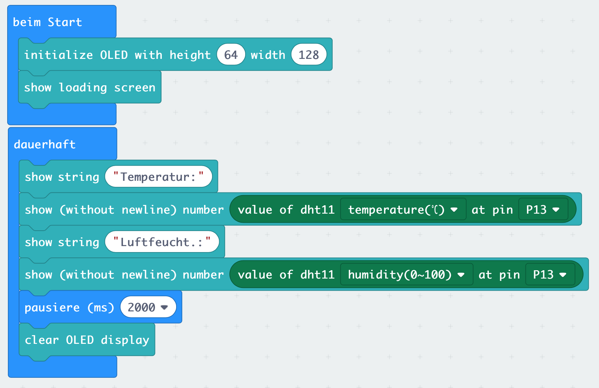

# Lektion 14

## Temperatursensor DHT11 oder DHT22 und OLED

In den vorherigen Lektionen hast Du bereits erfahren, wie Du den MakeCode-Editor für __Micro:Bit__ mit _Erweiterungen_ um noch mehr sinnvolle Funktionen erweitern kannst. In dieser Lektion ließt Du die Temperatur und Luftfeuchtigkeit von einem externen Temperatur- und Feuchtigkeitsensor (DHT11 oder  DHT22) aus und stellst diese auf einem kleinen OLED dar.

#### Erweiterung installieren

Um den Sensor mit dem __Micro:Bit__ auslesen zu könnnen, musst Du die __Environment-IoT__-Erweiterung installieren. Diese Erweiterung gehört zu einem speziellen Starter-Set für den __Micro:Bit__ und umfasst unterschiedliche Sensoren. Daher enthält die __Environment-IoT__-Erweiterung viele neuen Blöcke, mit denen Unterschiedliche Sensoren angesteuert werden können, u.a. auch der DHT11-Sensor. 

Wähle  unter dem Block _Fortgeschritten_ den Punkt _Erweiterungen_ und suche anschließend nach der __Environment-IoT__ Bibliothek. Füge diese dem Makecode Editor hinzu. Dadurch erhälst Du folgende weiterer Blöcke.

#### Temperatur- und Feuchtigkeitssensor DHT11

Der hier verwendete Temperatursensor DHT11 verfügt lediglich über drei Anschlüsse und enthält bereits einen Pull-Up-Widerstand. Es gibt auch Modelle, die mit vier Anschlüssen und ohne Widerstand geliefert werden, dort bleibt dann ein PIN unbelegt und es muss zusätzlich ein Widerstand vorgeschaltet werden.

#### OLED 64x128 I2C 0,96'' Monochrome Display

Das hier verwendete Display hat eine Größe von 0,96 Zoll, dies entspricht etwa 2,4 cm in der Diagonale. Das OLED kann 64x128 Bildpunkte (Pixel) in einer Farbe (monochrome) darstellen. Angeschlossen wird es über den I2C-Bus, eine Verbindungsart bei der bis zu 127 Geräte gleichzeitig über lediglich zwei Leitungen (SCL und SDA) gesteuert werden können.

#### Anschlüsse

Schließe  den Temperatursensor DHT11 oder DHT22 und das OLED wie in folgendem Bild dargestellt an Deinen __Micro:Bit__ an. 

#### Blocks

