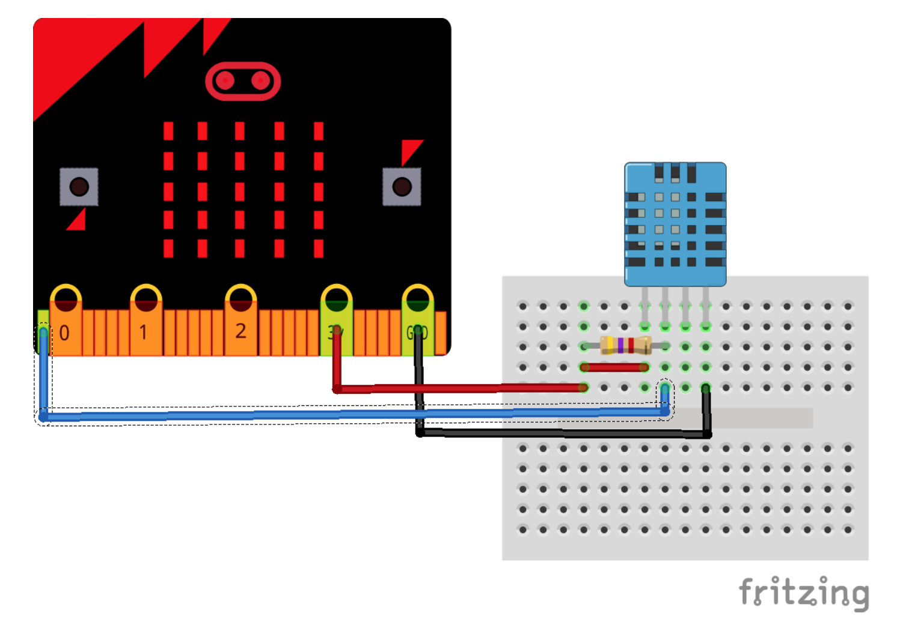

# Lektion 11

## Temperatursensor anschließen 

Schließe wie im Bild dargestellt einen _DHT 11 Temperatursensor_ oder einen _DHT 22 / AM2302 Temperatur- und Luftfeuchtigkeitssensor_ an Deinen Micro:Bit an.

