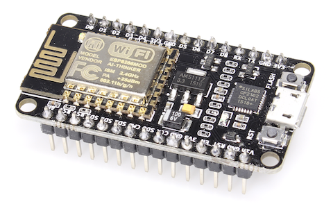
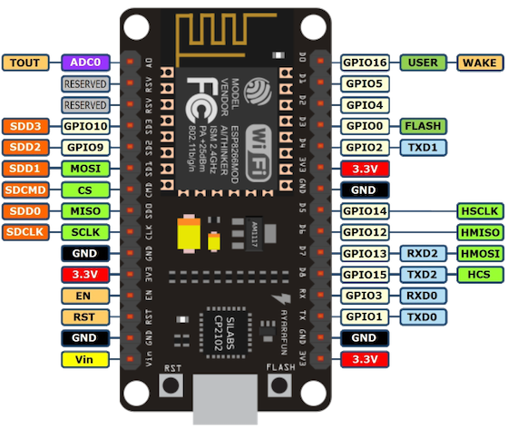

# NodeMCU auf ESP8266-Basis

NodeMCU ist ein Open Source Einplatinencomputer auf Basis des Espressif ESP8266 Microcontroller. Ursprünglich gedacht ist das Board für die Entwicklung mit __LUA__, im Auslieferungszustand kommt es mit der entsprechenden Open-Source Firmware. Das Board wird aber auch von Arduino und Micropython  unterstützt.

## Board-Layout

## Links

[NodeMCU Website](https://www.nodemcu.com/index_en.html)

[Readthedocs](https://nodemcu.readthedocs.io/en/master/)
