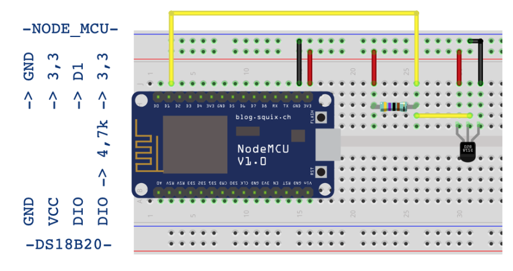
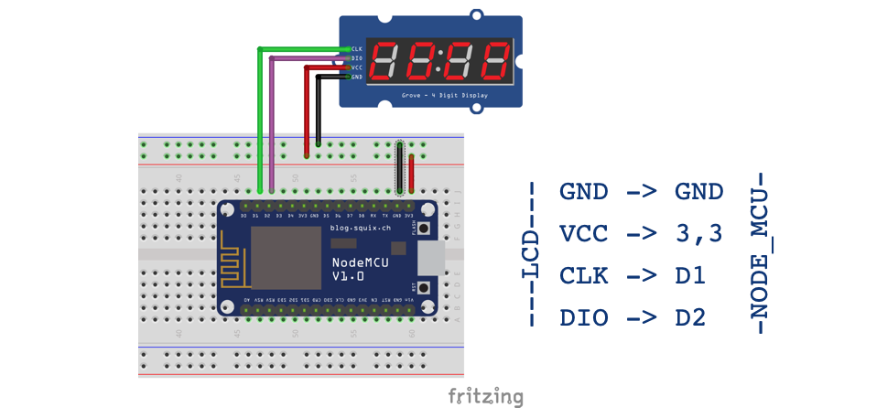
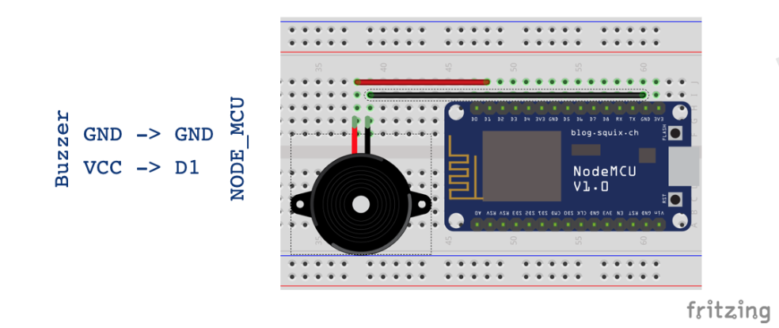

# IoT Temperaturmessung

In dieser Lektion entwickelst Du mit anderen in Gruppen ein verteiltes System, das an einem Microcontroller die Temperatur mißt, diese an einen MQTT-Broker sendet und an zwei weiteren Microcontrollern weiterverarbeitet.

## Temperatur-Meßstation

## Temperatur-Anzeige

## Alarm-Station

