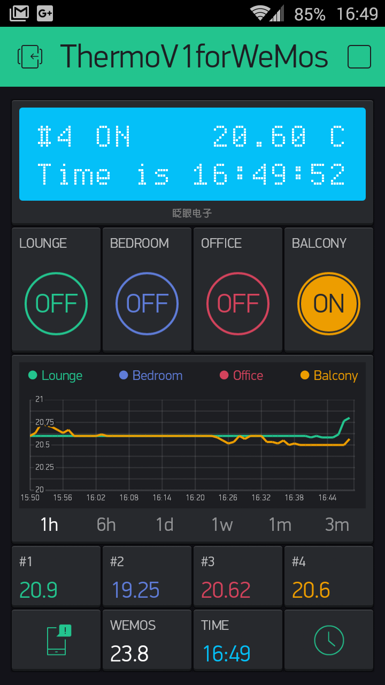
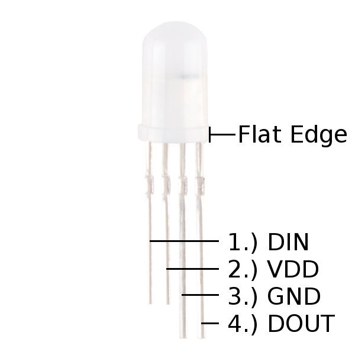
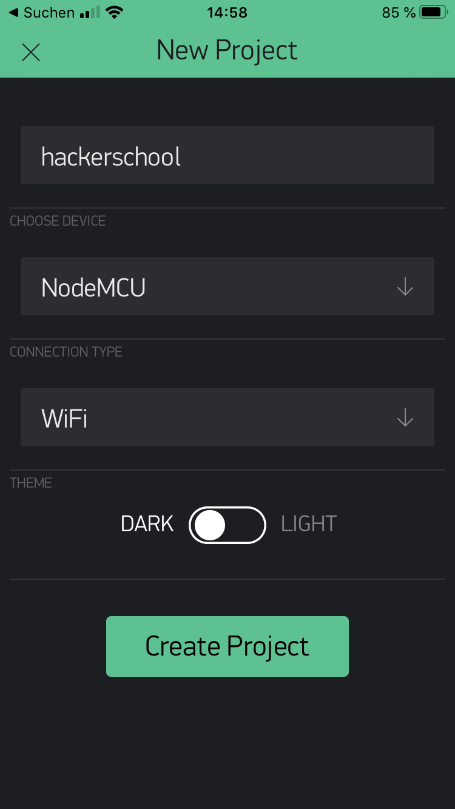
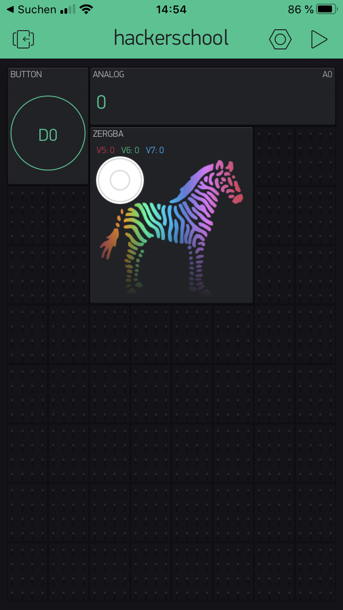
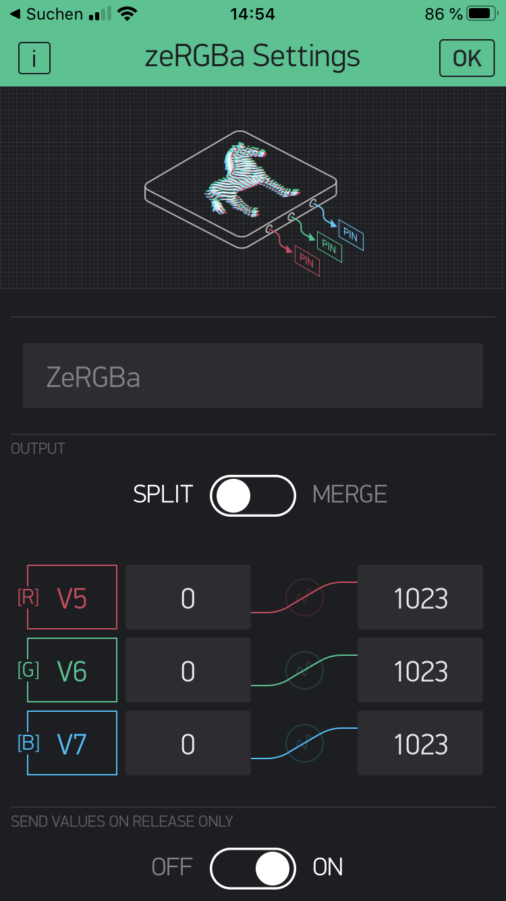

# NodeMCU mit Blynk und Arduino

Blynk ist eine Internet of Things (IoT) Plattform, die den Einstieg in das Thema IoT sehr vereinfacht. Blynk stellt eine komplette Infrastruktur bereit, uber die IoT-Geräte, wie z.B. NodeMCU oder andere Microcontroller, untereinander oder mit anderen Geräten Daten austauschen können.

## Installation Blynk-App

Ein großer Vorteil von Blynk ist, dass sehr einfach per Drag-n-drop iOS- und/oder Android-Apps entwickelt werden können, die mit den IoT-Geräten kommunizieren um z.B. Sensordaten abzufragen oder Schaltvorgänge auszulösen. Hier ein Beispiel.

Um mit Blynk starten zu können, installiere Dir zunächst die App aus dem Apple-App-Store oder Google-Play-Store.

## Anschlüsse

Schließe nun eine Neopixel-LED an Deinen __NodeMCU__ an. Dabei ist es egal, ob es sich um einen Neopixel-Stick oder eine einzelne Neopixel-LED handelt, die Anschlussart ist gleich.

Für diese Lektion benötigen wir nur drei _"Beinchen"_, die wie folgt angeschlossen werden.

| Neopixel | NodeMCU | Erklärung|
|---|:---|:---|
|DIN | D2 | Steuerleitung|
|VDD | 3,3V | Spannungsversorgung (3V-7V)|
|GND | GND | Masseleitung|

## Blynk-App

___Hinweis__: Es ist auch möglich einen eigenen Blynk-Server zu betreiben. Dann kannst Du Dich am eigenen Server anmelden. Mehr dazu._

Nachdem Du die Blynk-App installiert hast und ein Konto angelegt hast, kannst Du damit beginnen ein neues Projekt einzurichten. Erstelle zunächst ein neues Projekt, vergin diesem einen Namen Deiner Wahl und wähle dann als Gerät (Device) `NodeMCU` aus. Dies ist wichtig damit später die Zuordnung der einzelnen analogen und digitalen Pins korrekt funktioniert.

Für unser Beispiel benötigen wir einen digitalen Schalter und eine RGB-Auswahl, die in der Blynk-App über das ZERGBA-Element erfolgt. Platziere dieses Elemet irgendwo auf dem Bildschirm und tippe anschließend auf das ZERGBA-Element um in die Einstellungen zu gelangen.

In den Einstellungen ordnen wir den einzelnen Farben rot, grün und blau jeweils einen virtuellen PIN zu. Verwende dazu folgende virtuellen Pins.

|Pin | Farbe|
|---|:---|
|V5 |Rot (red) |
|V6 |Grün (green)|
|V7 |Blau (blue) |

Die restlichen Einstellungen müssen nicht geändert werden. Speichere die Einstellungen mit `OK` und starte die App.

## Arduino Sketch

Erstelle einen Sketch, in dem Du über virtuelle Pins die drei Farbwerte für rot, grün und gelb abfragst und dann die Farbe des Neopixel entsprechend änderst.

___ToDo: Anleitung...___


    
